# CSCE 435 Group project

## 0. Group number: 20

## 1. Group members:
1. Victoria Chen
2. Arielle Shaver
3. Victoria Chiang
4. Bonnie Wu

We are using a group chat over text to communicate.

## 2. Project topic (e.g., parallel sorting algorithms)
Parallel Sorting Algorithms

### 2a. Brief project description (what algorithms will you be comparing and on what architectures)

- Bitonic Sort (Bonnie): 
- Sample Sort (Arielle):
- Merge Sort (Victoria):
- Radix Sort (Vic):

### 2b. Pseudocode for each parallel algorithm
- For MPI programs, include MPI calls you will use to coordinate between processes
- Radix Sort:
```
// Initialize MPI
MPI_Init()
Get the number of processes (n_procs)
Get the rank of each process (rank)

// Main process (rank 0), read and distribute the data
if rank == 0 then
    Read the input array
    Split the input data into n_procs parts
end if

// Scatter the data to all processes given the main process of 0
MPI_Scatter(data, local_data, root=0)

// For each digit LSD to MSD:
for each digit in LSD to MSD do
    // Count the frequency of each digit in the local data
    local_histogram = calculate_histogram(local_data, digit)
    
    // Share and combine all local histograms to create a global histogram
    global_histogram = MPI_Allreduce(local_histogram, MPI_SUM)

    // Use the global histogram to figure out where data needs to go
    prefix_sum = calculate_prefix_sum(global_histogram)
    
    // Exchange data between processes based on prefix_sum
    MPI_Alltoallv(local_data, send_counts, recv_counts, sorted_data)

    // Update local data with the received sorted data
    local_data = sorted_data
end for

// Gather all the sorted data back to process 0
MPI_Gather(local_data, sorted_array, root=0)

// Finalize MPI (clean up and end the program)
MPI_Finalize()

```
- Merge Sort:
```
    Main:  
        1. Initialize MPI - MPI_Init()
            a. MPI_INIT(&argc, &argv)
        2. Rank and size of MPI COMM_WORLD
            a. MPI_Comm_rank, MPI_Comm_size
        3. If rank == 0 then: read in the input array, split the input array into the number of processes part
            a. Use a fixed array for sorting so it is the same across all different types of sorting 
            b. no variable is our size of array 
        4. Broadcast that size of array to all the processes using MPI_Bcast
            a. MPI_Bcast(no, 1, MPI_INT, 0, MPI_COMM_WORLD)
        5. Find the size of each subarray for each of the process: subSize = no  / world size (from mpi_comm_size)
        6. Allocate a memory for each process’s subarray with subSize
        7. Scatter the original array into all the subarrays
            a. MPI_Scatter()
        8. Allocate temp array for merging with subSize
        9. Every process will perform merge sort on its own subarray 
            a. mergeSort(subarray, temparray, 0, subSize-1)
        10. Root process - gathers all the sorted subarrays 
            a. World rank is 0, we want to make a sorted array with the size of the array (no)
        11. Perform MPI_Gather to grab all the sorted subarrays from all the processes 
        12. Final merge with the root process so world rank is 0, create another array with the no variable size and use mergeSort function
        13. Add a print statement that prints out the sorted array to check 
        14. Free any memory and finalize the MPI environment: MPI_Finalize()


    Merge Function: * merge two sorted halves of one array into a complete sorted single array*
        1. Set lh= to the start index to the left half, set i= to the start index for the temporary array (temp array), 
            set rh= to the starting index of the right half (ending index of the first half + 1)
        2. While loop to start merging and compare the elements in both halves: * loop will finish after one half is processed* -> 
            While (lh <= ending index of first half && rh <= ending index of that array portion needed to sort)
                a. If current element array[lh] is <= to the current element in the right half so array[rh] we want to copy the array[lh] into the temp array at i and then increment the lh and the i
                b. Else we want to do the opposite so array[rh] to temp array at i and increment the rh and the i
        3. Remaining elements will be copied:
            a. If there are elements in the right half leftover or the left it will be copied into the temp array 
            b. Check the index and the end of side index to see if one side has been fully processed or not 
        4. Copy the sorted elements from the temp array all back to the original array
            a. using a for loop and the indexes 

    MergeSort Function: *recursive merge sort algorithm without impacting any MPI*
        1. Check if the starting index is less than the ending index of the array -> if LI < RI -> want to make sure the array 
            has more than one element
                a. Find the middle index: mid = (LI + RI) / 2, average of left and right index divided by 2
                b. Recursively call mergeSort so it can sort the left half -> LI to mid, left index to mid index 
                c. Recursively call mergeSort so it can sort the right half -> mid+1, RI, mid+1 index to right index
                d. Merge Function called so we can combine it into a single sorted array 
	
```
- Sample Sort:
```
Main Function:

    1. Get user input for data_type, size (total number of elements), and num_procs (number of processors).

    2. // Initialize MPI
       MPI_Init()  // Set up MPI environment for parallel processing
       task_id = MPI_Comm_rank(MPI_COMM_WORLD)  // Get rank of the current process (task_id)
       num_tasks = MPI_Comm_size(MPI_COMM_WORLD)  // Get the total number of processes available (num_tasks)

    3. // Check if there are enough tasks available
       If num_tasks < 2:
           Print "Need at least two MPI tasks. Quitting..."
           MPI_Abort(MPI_COMM_WORLD, error_code = -1)
           Exit program

    4. Set the number of buckets (m) = num_tasks  // m is the total number of processes, which will sort in parallel.
    
    5. // Synchronize all processes
       MPI_Barrier(MPI_COMM_WORLD)

    6. // Master Process
       If task_id == MASTER:
           Print "Parallel samplesort with master-worker has started with", num_tasks, "tasks."
           Print "Initializing data..."

           // Generate input data of specified data_type
           Generate size amount of input_data of type data_type 

           // Draw a sample of size s
           // Choose s based on some multiple of m (s = m * oversampling_factor)
           s = m * oversampling_factor
           Sample s elements from input_data  // Randomly select s elements for good splitter selection

           // Sort the sampled elements
           Sort the sampled elements using quicksort
           QuickSort(sampled_elements, length(sampled_elements))

           // Select m-1 splitters from the sorted samples
           Select the s/m, 2*(s/m), ..., (m-1)*(s/m) elements as splitters
           // These m-1 splitters will be used to partition the entire dataset into m buckets.

       // Broadcast the splitters to all processes
       MPI_Bcast(splitters, m-1, data_type, root=MASTER, comm=MPI_COMM_WORLD)

    7. // All Processes (Master and Workers)

       // Scatter the input data to all processes
       local_size = size / num_tasks  // Calculate the size of data each process will receive
       local_data = Array[local_size]

       MPI_Scatter(input_data, local_size, data_type, local_data, local_size, data_type, root=MASTER, comm=MPI_COMM_WORLD)
       // Each process now has its portion of the data to work on

       // Each process partitions its data into m buckets
       Local_buckets = Create m empty buckets for partitioning

       // Assign data to buckets based on splitters
       For each element in local_data:
           Determine the correct bucket for the element based on splitters
           Append element to the corresponding bucket in Local_buckets

       // Prepare data for sending to other processes
       // Convert Local_buckets to an appropriate structure for MPI_Alltoallv
       send_counts = [Number of elements in each bucket to send to each process]
       send_displacements = [Offsets for each bucket to be sent]

       // Use MPI_Alltoallv to exchange bucket data among processes
       recv_counts = [Number of elements to receive from each process]  // Allocate space for receiving bucket data
       recv_displacements = [Offsets for each received bucket]

       total_recv_size = sum(recv_counts)  // Total size of received data
       recv_data = Allocate array of size total_recv_size

       MPI_Alltoallv(Local_buckets, send_counts, send_displacements, data_type, recv_data, recv_counts, recv_displacements, data_type, comm=MPI_COMM_WORLD)
       // Each process now has all the elements that belong to its assigned bucket
       local_bucket = recv_data  // This is the bucket each process will sort

       // Sort the received bucket using iterative quicksort
       Print "Task", task_id, "sorting its bucket..."
       QuickSort(local_bucket, length(local_bucket))

    8. // Gather sorted buckets back to the master

       // Use MPI_Gather to gather all sorted buckets
       sorted_bucket_size = length(local_bucket)
       sorted_buckets = None
       If task_id == MASTER:
           sorted_buckets = Array[size]  // Master will gather all sorted data

       MPI_Gather(local_bucket, sorted_bucket_size, data_type, sorted_buckets, sorted_bucket_size, data_type, root=MASTER, comm=MPI_COMM_WORLD)

    9. // Master Process
       If task_id == MASTER:
           // Concatenate all sorted buckets to get the final sorted data
           Final_sorted_data = concatenate(sorted_buckets)
           Print "Parallel samplesort completed."

   10. // Finalize MPI environment
       MPI_Finalize()

End Main Function


// Iterative Quicksort Algorithm Function
QuickSort Function (arr, n):
    // arr: array to be sorted
    // n: size of the array

    Create an empty stack stack
    Push (0, n - 1) onto stack  // Push initial subarray (full range)

    While stack is not empty:
        // Pop high and low indices from stack
        (low, high) = Pop(stack)
        
        // Partition the array
        If low < high:
            // Choose the pivot element as the last element
            pivot = arr[high]
            i = low - 1

            // Rearrange elements based on pivot
            For j from low to high - 1:
                If arr[j] <= pivot:
                    i = i + 1
                    Swap arr[i] and arr[j]

            // Put the pivot in its correct position
            Swap arr[i + 1] and arr[high]
            pivot_index = i + 1

            // Push the left and right subarrays onto the stack
            // Left subarray: elements less than the pivot
            If (pivot_index - 1) > low:
                Push (low, pivot_index - 1) onto stack

            // Right subarray: elements greater than the pivot
            If (pivot_index + 1) < high:
                Push (pivot_index + 1, high) onto stack

End Function

```
Bitonic Sort
```
MAIN BEGIN
    // Initialize MPI
    MPI_Init()
    
    // Get the number of processes
    MPI_Comm_size()
    
    // Get the rank/ID of the process
    MPI_Comm_rank()
    
    // Scatter data among processes
    MPI_Scatter()
    
    // Bitonic Sort process
    for (i = 0; i < log(number processes); i++) {  // log(n) stages of sorting, also creates distance between partners as sorting progresses
        for (j = i; j >= 0; j--) {      // Comparing pairs (ex: if i = 2, j takes the values 2, 1, and 0)
            if ((process_rank >> (i + 1)) % 2 == 0 && (process_rank >> j) % 2 == 0) || ((process_rank >> (i + 1)) % 2 != 0 && (process_rank >> j) % 2 != 0){ 
		// Use rightshift operator to determine which processes are swapping for the current stage of sorting (ascending or descending order)
                // Both ranks are even or both are odd
                Swap elements in ascending order (smaller rank will have smaller number)
                (send maximum value to partner
                receive minimum value from partner)
            } 
            else if ((process_rank >> (i + 1)) % 2 != 0 && (process_rank >> j) % 2 != 0) {
                // One rank is even and one is odd
                Swap elements in descending order (vice versa to the ascending one)
                (send minimum value to partner
                receive maximum value from partner)
            }
        }
    }

    // Gather results back to the root process
    MPI_Gather()
    
    // Finalize MPI
    MPI_Finalize()
MAIN END
```

### 2c. Evaluation plan - what and how will you measure and compare
- Input sizes: 2^16, 2^18, 2^20, 2^22, 2^24, 2^26, 2^28
- Input types: Sorted, Random, Reverse sorted, 1% perturbed
- Strong scaling (same problem size, increase number of processors/nodes)
- Weak scaling (increase problem size, increase number of processors)
- For number of processors: 2, 4, 8, 16, 32, 64, 128, 256, 512, 1024


For each algorithm (Bitonic Sort, Sample Sort, Merge Sort, Radix Sort), the following metrics will be measured:
- **Execution Time**: Track the time required to complete the sort for various input sizes, input types, and processor counts.
- **Speedup**: Compare the parallel execution time with the sequential baseline to assess the improvement for each algorithm.
- **Efficiency**: Determine how effectively each algorithm uses additional processors by calculating speedup divided by the number of processors.

#### Strong Scaling:
- **Objective**: Analyze how each algorithm performs as the number of processors increases while keeping the input size constant.
- **Method**: For a fixed input size (e.g., 2^24 elements), run the algorithm with 2, 4, 8, 16, 32, and more processors. We will measure execution time and calculate speedup and efficiency for each case.
- **Comparison**: Evaluate how each algorithm’s execution time changes with different processor counts.

#### Weak Scaling:
- **Objective**: Evaluate how well each algorithm handles increasing input sizes as the number of processors grows proportionally, while ensuring each processor has sufficient work to do.

- **Method**: For each input type (Sorted, Random, Reverse Sorted, 1% Perturbed), we will start with a small input size and a reasonable number of processors. As we increase the input size, we plan to proportionally increase the number of processors:
  - 2^16 elements for 2 processors
  - 2^18 elements for 4 processors
  - 2^20 elements for 8 processors
  - 2^22 elements for 16 processors
  - 2^24 elements for 32 processors
  - 2^26 elements for 64 processors
  - 2^28 elements for 128 processors
  - 2^28 elements for 256 processors
  - 2^28 elements for 512 processors
  - 2^28 elements for 1024 processors

- **Comparison**: Measure the execution time for each combination of input size and processor count. The goal is to maintain a stable execution time as both the input size and the number of processors increase, showing strong weak scaling properties.


### 3a. Caliper instrumentation
Please use the caliper build `/scratch/group/csce435-f24/Caliper/caliper/share/cmake/caliper` 
(same as lab2 build.sh) to collect caliper files for each experiment you run.

Your Caliper annotations should result in the following calltree
(use `Thicket.tree()` to see the calltree):
```
main
|_ data_init_X      # X = runtime OR io
|_ comm
|    |_ comm_small
|    |_ comm_large
|_ comp
|    |_ comp_small
|    |_ comp_large
|_ correctness_check
```

Required region annotations:
- `main` - top-level main function.
    - `data_init_X` - the function where input data is generated or read in from file. Use *data_init_runtime* if you are generating the data during the program, and *data_init_io* if you are reading the data from a file.
    - `correctness_check` - function for checking the correctness of the algorithm output (e.g., checking if the resulting data is sorted).
    - `comm` - All communication-related functions in your algorithm should be nested under the `comm` region.
      - Inside the `comm` region, you should create regions to indicate how much data you are communicating (i.e., `comm_small` if you are sending or broadcasting a few values, `comm_large` if you are sending all of your local values).
      - Notice that auxillary functions like MPI_init are not under here.
    - `comp` - All computation functions within your algorithm should be nested under the `comp` region.
      - Inside the `comp` region, you should create regions to indicate how much data you are computing on (i.e., `comp_small` if you are sorting a few values like the splitters, `comp_large` if you are sorting values in the array).
      - Notice that auxillary functions like data_init are not under here.
    - `MPI_X` - You will also see MPI regions in the calltree if using the appropriate MPI profiling configuration (see **Builds/**). Examples shown below.

All functions will be called from `main` and most will be grouped under either `comm` or `comp` regions, representing communication and computation, respectively. You should be timing as many significant functions in your code as possible. **Do not** time print statements or other insignificant operations that may skew the performance measurements.

### **Nesting Code Regions Example** - all computation code regions should be nested in the "comp" parent code region as following:
```
CALI_MARK_BEGIN("comp");
CALI_MARK_BEGIN("comp_small");
sort_pivots(pivot_arr);
CALI_MARK_END("comp_small");
CALI_MARK_END("comp");

# Other non-computation code
...

CALI_MARK_BEGIN("comp");
CALI_MARK_BEGIN("comp_large");
sort_values(arr);
CALI_MARK_END("comp_large");
CALI_MARK_END("comp");
```

### **Calltree Example**:
```
# MPI Mergesort
4.695 main
├─ 0.001 MPI_Comm_dup
├─ 0.000 MPI_Finalize
├─ 0.000 MPI_Finalized
├─ 0.000 MPI_Init
├─ 0.000 MPI_Initialized
├─ 2.599 comm
│  ├─ 2.572 MPI_Barrier
│  └─ 0.027 comm_large
│     ├─ 0.011 MPI_Gather
│     └─ 0.016 MPI_Scatter
├─ 0.910 comp
│  └─ 0.909 comp_large
├─ 0.201 data_init_runtime
└─ 0.440 correctness_check
```

### Implementations

Bitonic Calltree:
```
1.720 main
├─ 0.000 MPI_Init
├─ 0.000 data_init_runtime
├─ 0.026 comp
│  ├─ 0.006 comp_small
│  └─ 0.079 comp_large
├─ 0.006 comm
│  └─ 0.006 MPI_Gather
├─ 0.000 correctness_check
├─ 0.000 MPI_Finalize
├─ 0.000 MPI_Initialized
├─ 0.000 MPI_Finalized
└─ 0.080 MPI_Comm_dup
```

Sample Sort Calltree:

```
30.491 main
├─ 0.000 MPI_Init
├─ 0.228 data_init_runtime
├─ 7.454 comp
│  ├─ 3.980 comp_small
│  └─ 3.474 comp_large
├─ 1.377 comm
│  ├─ 0.021 comm_small
│  │  ├─ 0.004 MPI_Gather
│  │  └─ 0.016 MPI_Bcast
│  └─ 1.356 comm_large
│     ├─ 0.015 MPI_Alltoall
│     └─ 0.222 MPI_Alltoallv
├─ 0.115 correctness_check
├─ 0.000 MPI_Finalize
├─ 0.000 MPI_Initialized
├─ 0.000 MPI_Finalized
└─ 19.820 MPI_Comm_dup

```

Merge Sort Calltree:

```
2.422 main
├─ 0.000 MPI_Init
├─ 0.091 data_init_runtime
├─ 0.017 comm
│  ├─ 0.012 MPI_Barrier
│  └─ 0.005 comm_large
│     ├─ 0.004 MPI_Scatter
│     └─ 0.001 MPI_Gather
├─ 0.048 comp
│  └─ 0.048 comp_large
├─ 0.016 correctness_check
├─ 0.000 MPI_Finalize
├─ 0.000 MPI_Initialized
├─ 0.000 MPI_Finalized
└─ 0.674 MPI_Comm_dup

```

Radix Sort Calitree

```
1.664 main
├─ 0.000 MPI_Init
├─ 0.000 data_init_runtime
├─ 0.060 comp
│  ├─ 0.000 comp_small
│  └─ 0.060 comm
│     ├─ 0.054 comm_small
│     │  └─ 0.054 MPI_Alltoall
│     └─ 0.006 comm_large
│        └─ 0.006 MPI_Alltoallv
├─ 0.000 correctness_check
├─ 0.000 MPI_Finalize
├─ 0.000 MPI_Initialized
├─ 0.000 MPI_Finalized
└─ 0.000 MPI_Comm_dup
```

### 3b. Collect Metadata

Have the following code in your programs to collect metadata:
```
adiak::init(NULL);
adiak::launchdate();    // launch date of the job
adiak::libraries();     // Libraries used
adiak::cmdline();       // Command line used to launch the job
adiak::clustername();   // Name of the cluster
adiak::value("algorithm", algorithm); // The name of the algorithm you are using (e.g., "merge", "bitonic")
adiak::value("programming_model", programming_model); // e.g. "mpi"
adiak::value("data_type", data_type); // The datatype of input elements (e.g., double, int, float)
adiak::value("size_of_data_type", size_of_data_type); // sizeof(datatype) of input elements in bytes (e.g., 1, 2, 4)
adiak::value("input_size", input_size); // The number of elements in input dataset (1000)
adiak::value("input_type", input_type); // For sorting, this would be choices: ("Sorted", "ReverseSorted", "Random", "1_perc_perturbed")
adiak::value("num_procs", num_procs); // The number of processors (MPI ranks)
adiak::value("scalability", scalability); // The scalability of your algorithm. choices: ("strong", "weak")
adiak::value("group_num", group_number); // The number of your group (integer, e.g., 1, 10)
adiak::value("implementation_source", implementation_source); // Where you got the source code of your algorithm. choices: ("online", "ai", "handwritten").
```


Bitonic Metadata:
The metadata collected for bitonic sort includes the following information:
```
launchdate: 1729117054,
libraries: [/scratch/group/csce435-f24/Caliper/caliper/lib],
cmdline: [./mergesort, 65536, 4, Random],
algorithm: bitonic_sort,
programming_model: mpi, 
data_type: int, 
size_of_data_type: 4, 
input_size: 65536, 
input_type: Random,
num_procs: 4,
scalability: strong,
group_num: 20,
implementation_source: handwritten
```

Sample Sort Metadata:
```
cali.caliper.version: 2.11.0
mpi.world.size: 32
spot.metrics: min#inclusive#sum#time.duration, max#inclusive#...
spot.timeseries.metrics: (not provided)
spot.format.version: 2
spot.options: time.variance, profile.mpi, node.order, region.count
spot.channels: regionprofile
cali.channel: spot
spot:node.order: true
spot:output: p32-a268435456.cali
spot:profile.mpi: true
spot:region.count: true
spot:time.exclusive: true
spot:time.variance: true
launchdate: 1729094595
libraries: [/scratch/group/csce435-f24/Caliper/caliper/lib]
cmdline: [./samplesort, 268435456, 32, Random]
cluster: c
algorithm: sample_sort
programming_model: mpi
data_type: int
size_of_data_type: 4
input_size: 268435456
input_type: Random
num_tasks: 32
scalability: strong
group_num: 20
implementation_source: handwritten
```

Merge Sort Metadata:
```
cali.caliper.version: 2.11.0
mpi.world.size: 32
spot.metrics: min#inclusive#sum#time.duration, max#inclusive#...
spot.timeseries.metrics: (not provided)
spot.format.version: 2
spot.options: time.variance, profile.mpi, node.order, region.count
spot.channels: regionprofile
cali.channel: spot
spot:node.order: true
spot:output: p32-a4194304.cali
spot:profile.mpi: true
spot:region.count: true
spot:time.exclusive: true
spot:time.variance: true
launchdate: 1729123305
libraries: [/scratch/group/csce435-f24/Caliper/caliper/li...]
cmdline: [./mergesort, 4194304, 32, random]
cluster: c
algorithm: merge
programming_model: mpi
data_type: int
size_of_data_type: 4
input_size: 4194304
input_type: random
num_procs: 32
scalability: strong
group_num: 20
implementation_source: handwritten

```

Radix Sort
```
cali.caliper.version: 2.11.0
mpi.world.size: 32
spot.metrics: min#inclusive#sum#time.duration, max#inclusive#sum#time.duration, avg#inclusive#sum#time.duration
spot.timeseries.metrics: true
spot.format.version: 2
spot.options: time.variance, profile.mpi, node.order, region.count, spot:output
spot.channels: regionprofile
cali.channel: spot
spot:node.order: true
spot:output: p32-a1024.cali
spot:profile.mpi: true
spot:region.count: true
spot:time.exclusive: true
spot:time.variance: true
launchdate: 1728970597
libraries: [/scratch/group/csce435-f24/Caliper/caliper/libcaliper.so]
cmdline: [./radixsort, 1024, Random]
cluster: c
algorithm: radix_sort
programming_model: mpi
data_type: int
size_of_data_type: 4
input_size: 1024
input_type: Random
num_tasks: 32
scalability: strong
group_num: 20
implementation_source: handwritten

```
They will show up in the `Thicket.metadata` if the caliper file is read into Thicket.

### **See the `Builds/` directory to find the correct Caliper configurations to get the performance metrics.** They will show up in the `Thicket.dataframe` when the Caliper file is read into Thicket.

## Algorithm Descriptions: 

- Sample Sort Algorithm:
```
    Helper Functions:

    1. void quicksort(std::vector<int>& arr);
        - Sorts the array given as an argument using std::sort. 

    2. std::vector<int> generateSortedData(int size);
        - Creates a vector called data.
        - Through a for loop adds values from 0 to inputted size
        to create a sorted array and returns it. 

    3. std::vector<int> generatePerturbedData(int size);
        - Creates a vector called data using the generateSortedData function.
        - Calculates 1% of the size given. 
        - For 1% of the total size of values swap random elements in the
        array to generate perturbed data.

    4. std::vector<int> generateRandomData(int size);
        - Creates a vector called data
        - Through a for loop from index 0 to inputted_size
        generates random data and adds it to vector.

    5. std::vector<int> generateReverseSortedData(int size);
        - Creates a vector called data.
        - Through a for loop adds values from inputted size - 1 to 0
        to create a reversed sorted array and returns it. 

    6. std::vector<int> generateRandomInput(int size, const std::string& input_type)
        - Uses the given input_type to decide which generation function to use.
        - Calls data generation function based on input_type. 
          If the input_type = "Random", it will call generateRandomData(int size).
    
    Main Function:

    1. Initalize MPI
        The algorithm starts by initializing the MPI environment 
        using MPI_Init and setting up task ids for each process 
        and the total number of processors (num_tasks).
        Adiak is then initialized to collect metadata about the execution environment.

    2. Set variables from job script arguments 
        The input parameters passed to the program are extracted:
            input_size: Total number of elements in the array to be sorted.
            num_tasks: Number of processors.
            input_type: The type of data input (sorted, random, etc.).
    
    3. Ensure there are at least two processors
        If statement to make sure num_tasks is at least 2. If not,
        then the program will abort. 

    4. Adiak collects various data about the program 
        This includes algorithm, input_type, etc. 

    5. Generate data for sorting 
        We start off by marking the region of init with caliper for timing.
        A vector for local_data is created to generate an array based 
        off of the input type. Each processor will receive a certain 
        size of data to generate. This will be evenly divided. 
        For example, if there are 8 processors, each processor 
        generates input_size / 8 elements based on the specified input_type.
    
    6. Sort local data 
        Each processor will sort the data that it created.
        This will once again be timed by caliper but 
        it will be noted as a small computation since we 
        are only sorting local data and not the whole array.
    
    7. Drawing sample size 
        Each processor will draw a sample size to determine how many values to sample.
        The size s is computed as the logarithm of the number of local data 
        elements (log2(local_data.size())). The purpose of this is to reduce
        communication overhead by ensuring that the sample size will be more consistent
        to the size of the data. Based on this sample size, each processor will 
        randomly pick s samples from its data. 
    
    8. Gathering samples 
        All processors send their local samples to a designated root process 
        using MPI_Gather. MPI_Gather will collect the samples from all 
        processors and send them to a designated root processor. 
        The root processor receives all the samples and will combine
        them into a single array. This process will be marked and timed
        as a small communication by caliper. 
    
    9. Sample Sorting and Splitting 
        The root process now sorts the samples. It then selects num_tasks - 1 splitters 
        from the sorted samples, which will be used to partition the data 
        into buckets across all processors. Therefore the number of buckets and 
        the number of processors should be equivalent. The formula s * (i + 1) is used
        to secure indices ensuring a good distance that efficiently partions the data.
        The splitters are then broadcast to all processors using MPI_Bcast. 
        This ensures that every processor knows the ranges of each bucket. Sorting
        the samples is marked and timed as a small computation by caliper, while the 
        Bcast function will be marked and timed as a small communication. 

    10. Putting data into buckets 
         We create a 2D vector, buckets, where each inner vector represents a bucket. 
         The number of buckets is equal to the number of processors. 
         Each processor has its own bucket where data will be partitioned. 
         Each inner vector (buckets[i]) holds the values that will
         be sent to processor i during the data exchange phase. The code iterates 
         over each value in the local data. Each value will be placed into one of the buckets 
         based on the splitters. This loop goes through each splitter 
         to determine where the current value should be placed. The loop checks if the value 
         is less than or equal to the current splitter. If less, the bucket index 
         is set to i, meaning the value belongs in the bucket for that splitter. 
         The loop then breaks as the correct bucket is found. If the value is 
         greater than the current splitter, the code moves on to 
         check the next splitter and increments.

    1l. Assigning buckets to processors 
         We then initialize our counts. We will use these
         to assign sizes of each buckets to sendcounts to tell MPI
         how much each processor will be sending to other processors
         and receiving from other processors. Using all to all, we 
         send these values to all of the processors. Next we 
         calculate the total size of data the current processor will receive
         by summing up all elements in recvcounts and initialize
         recvbuf to hold the data. The send_index and 
         receive_index arrays are then set up to indicate the starting positions 
         for sending and receiving data in the buffers for each processor. 
         We then convert the 2D buckets vector into a single sendbuf 
         vector so that it can be processed by MPI, enabling each processor 
         to send its data to the appropriate destination.

    12. Sending data to buckets and sorting data 
         Using MPI_Alltoallv, each processor sends its data in each bucket 
         to the appropriate processors. This and steps 10-11 are marked as a 
         large communication and timed by caliper. We then mark a large computation
         to time the sorting of all arrays by the processors. After receiving the 
         partitioned data, each processor sorts the received data locally.

    13. Correctness Check
         After sorting is completed, the alorithm checks if the locally
         sorted data is in order using std::is_sorted. If not, an error is called.

    14. Finalizing MPI
        The MPI environment is finalized, marking the end of the program.

```
- Merge Sort Algorithm:
```
	Sorting Functions:
	1. void merge(int *arr1, int *arr2, int LI, int mid, int RI):
		- This function allows for combination of two sorted subarrays into one sorted array.
		- It takes the left index, midpoint, right index to find the boundaries of each subarray within the original array.
		- As we go through each of the index for the left or right, we check if either the left or the right value in the each subarray is smaller before deciding which to copy into the temporary array.
		- If we have any leftover elements after the indexes are hit their respective conditions, it will copy those to the temporary array which is arr2 in this case.
		- Following the subarray sorting, the temporary array will be copied into arr1.
	2. void mergeSort(int *arr1, int *arr2, int LI, int RI):
		- This function will recursively divide the array into smaller subarrays before sorting them and merging them back sorted.
		- As long as the left index is less than the right index  which makes sure it has enough elements to sort (at least 2 elements), we would need to find the middle point.
		- This leads to the recursive call of mergeSort which allows it to keep dividing up the subarray for both left and the right sides in the subarray.
		- After the dividing is complete, the merging will take place where it will call the above merge function to merge the subarrays in a sorted manner.

	Main Function:
	1. Initialize MPI/Adiak
		- Begin by initializing the MPI environment and retrieving the rank of the current process with taskid as well as the total number of processes with numtasks
		- Initialize Adiak as well for performance monitoring and logging as well as to collect metadata 
	2. Input Validation
		- Ensure that there is three command-line arguments.
	3. Declare and Initialize Variables:
		- Read and convert the command-line arguments into its respective variables.
		- These arguments are the array size, number of processes, and the input type.
		- Make sure there are at least 2 MPI processes running in the program as the program needs multiple processes to distribute work.
	4. Collect Data with Adiak:
		- Collect the needed information with Adiak: algorithm, programming model, data type…
	5. Array Allocation:
		- Allocate memory for the original array based on the given input size in preparation for the population of the array 
	6. Array Population with Input Type:
		- Populate the original array with the input types: sorted, random, reverse, 1%perturbed.
		- Sorted: provide a basic sorted array based on the size of the array
		- Random: randomly generate numbers for the array
		- Reverse: provide a basic reversed array based on the size of the array
		- 1%perturbed: randomly select a few values and determine the amount of swaps 
		* this also marks the end of data initialization
	7. Subarray Size and Memory:
		- Determine each subarray size for process distribution
		- Allocate memory for the subarray to be able to hold data for the current process
	8. Scatter
		- Start tracking comm and comm_large performance
		- Use a barrier to synchronize all the processes in the communicator
		- Distribute subarrays from the original array to each of the processes
	9. Merge Sort
		- Start tracking comp and comp_large performance
		- Allocate a temporary memory for the tempArray that will be used for sorting in each process.
		- Call the mergeSort function to sort that subArray
	10. Allocate memory for final merge:
		- Create a pointer to be used for the final sorted array 
		- In the master process, we want to allocate memory for the final sorted array
	11. Gather:
		- Start tracking comm and comm_large performance
		- Use MPI_Gather to collect all the sorted subarrays from all the processes into the master process.
	12. Final Merge:
		- Make sure its all the master process before allocating another temporary memory for the new temporary array that will be used in the mergeSort process for the final sorting.
		- Start tracking comp and comp_large performance
		- Call the mergeSort function for the sorting of the final array
	13. Correctness Check:
		- Start correctness_check to measure performance
		- Use a boolean to check if its sorted with the is_sorted function. 
		- If the boolean is true then it has been sorted and will output into the file that “The data is sorted”. 
	14. Finalize and Cleanup
		- Free all memory allocated areas
	 	- Call MPI_Finalize() to finalize the MPI environment, finishing the program.
```
Bitonic Sort Algorithm:
```
Helper Functions:
1. quicksort(std::vector<int>& arr): Uses standard library's std::sort to sort a given vector of integers.
2. generateSortedData(int size): Generates a sorted vector of integers from 0 to size - 1 using a for loop.
3. generatePerturbedData(int size): Starts by creating a sorted vector. Then randomly swaps 1% of its elements to perturb the array.
4. generateRandomData(int size): Produces a vector of random integers, each ranging from 0 to size - 1.
5. generateReverseSortedData(int size): Generates a reverse-sorted vector of integers.
6. generateRandomInput(int size, const std::string& input_type): A function that calls the appropriate data generation method (random, sorted, perturbed, reversed) based on the user-specified input type. Or throws error if input type not valid.

Sorting Functions:
1. compare_and_swap(std::vector<int>& data, int i, int j, bool ascending): Compares two elements and swaps them if they are not in the correct order (specified by ascending).
2. bitonic_merge(std::vector<int>& data, int low, int cnt, bool ascending): This function merges two halves of a bitonic sequence by comparing and swapping elements based on the ascending flag. It first divides the sequence, performs comparisons, and recursively merges the subsequences until the sequence is fully sorted when cnt <= 1.
3. bitonic_sort(std::vector<int>& data, int low, int cnt, bool ascending): This function recursively divides the data into two subsequences: one sorted in ascending order and the other in descending order. It then uses bitonic_merge to combine them into a fully sorted sequence, continuing until the entire array is sorted.

Main Function:
1. MPI Initialization: We use MPI_Init to start MPI, MPI_Comm_rank for the process ID, and MPI_Comm_size to find the number of processes.
2. Metadata Collection: adiak statements – init, launchdate, libraries, cmdline, clustername – that will collect metadata from this algorithm.
3. Input Handling: Handles command line arguments passed to the program – input_size, num_tasks, input_type. Also aborts if number of processors is less than 2.
4. Metadata Collection: adiak statements – algorithm . . . implementation_source – that will collect metadata from this algorithm.
5. Local Data Distribution: Using the generateRandomInput function, each process receives a segment of the total array that they will have to sort locally. The type of data will be according to the specified input type (random, sorted, perturbed, reversed).
6. Local On Each Process: Sort each array with quicksort helper function.
7. MPI Gather: Part of comm, it collects the locally sorted data from all processes and gathers it into the root process (task 0).
8. Global Sorting: The root process performs the final bitonic sort on the globally collected data. The entire dataset is now sorted using the bitonic algorithm.
9. Correctness Check: Verifies that the sorted data is correctly ordered using std::is_sorted(). Checked by root process.
10. MPI Finalize: Cleans up and shuts down the MPI environment after program completion.

```

Radix Sort
```
Initialization:
MPI is initialized, and process ranks are retrieved.
Metadata about the run is recorded using Adiak.

Input Generation:
Each process generates a portion of the input data based on the user-specified input type (Sorted, Random, etc.).

generateSortedData(size): Generates an array of integers in ascending order from 0 to size-1.
generatePerturbedData(size): Perturbs the sorted array by randomly swapping 1% of its elements.
generateRandomData(size): Generates an array of random integers.
generateReverseSortedData(size): Generates an array of integers in descending order.

Radix Sort Setup
Bits per Pass: The program calculates how many bits are processed in each pass of Radix Sort. This is determined by the number of processes (num_tasks) and the available bits per integer (assumed to be 32 bits).
Radix: The number of "bins" or buckets is determined by shifting 1 by the number of bits per pass.
Total Passes: The number of passes required for sorting is calculated based on the bit width of integers.


Parallel Radix Sort:
Radix Sort is performed in parallel. Each process calculates the bits to sort and exchanges data with other processes during each pass.

The program runs Radix Sort in parallel across multiple MPI processes.
Loop Through Radix Passes: For each pass:
Computation Phase (CALI_MARK_BEGIN("comp_small")):
Each process determines which "bucket" or range of values each of its elements belongs to based on the current bit pass.
Data is organized into local buckets, with each bucket targeting a specific MPI process.
Communication Phase:
Processes exchange data with one another to ensure that all elements destined for a particular process are sent to the correct destination.
MPI_Alltoall() is used to exchange the number of elements each process will send/receive.
MPI_Alltoallv() is used to exchange the actual data between processes.
Local Data Update: After receiving data from other processes, each process updates its local data with the newly received elements.

Correctness Verification:
After sorting, each process verifies that its data is sorted.

Profiling and Metadata:
The algorithm is profiled using Caliper to measure computation and communication times. Metadata about the algorithm is also recorded using Adiak.

Finalization:
MPI is finalized, and the program terminates.

```

## 4. Performance evaluation

Include detailed analysis of computation performance, communication performance. 
Include figures and explanation of your analysis.

### 4a. Vary the following parameters
For input_size's:
- 2^16, 2^18, 2^20, 2^22, 2^24, 2^26, 2^28

For input_type's:
- Sorted, Random, Reverse sorted, 1%perturbed

MPI: num_procs:
- 2, 4, 8, 16, 32, 64, 128, 256, 512, 1024

This should result in 4x7x10=280 Caliper files for your MPI experiments.

### 4b. Hints for performance analysis

To automate running a set of experiments, parameterize your program.

- input_type: "Sorted" could generate a sorted input to pass into your algorithms
- algorithm: You can have a switch statement that calls the different algorithms and sets the Adiak variables accordingly
- num_procs: How many MPI ranks you are using

When your program works with these parameters, you can write a shell script 
that will run a for loop over the parameters above (e.g., on 64 processors, 
perform runs that invoke algorithm2 for Sorted, ReverseSorted, and Random data).  

### 4c. You should measure the following performance metrics
- `Time`
    - Min time/rank
    - Max time/rank
    - Avg time/rank
    - Total time
    - Variance time/rank

### Plots and Analysis:

- Bitonic Sort:

### Strong Scaling - Input Sizes

<div style="background-color:white; padding:10px;">
  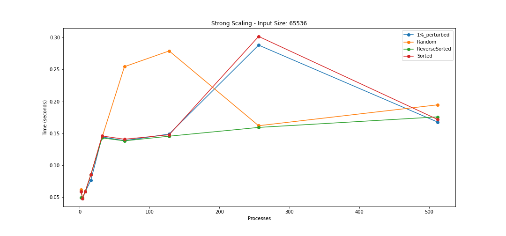
</div>

For the smallest input size in strong scaling, we don’t see much benefit in parallelization. There is a sharp increase in runtime until 32 processors, where reverse sorting plateaus, even as we increase processes. The 1% perturbed and sorted trendlines are the same except for a spike at 256 processes. Random’s time spikes until 128 processes and then hovers around 0.15 seconds. Given the trendlines are somewhat erratic for this graph, the communication and synchronization overheads probably outweigh the advantage of adding more processors at this size.

<div style="background-color:white; padding:10px;">
  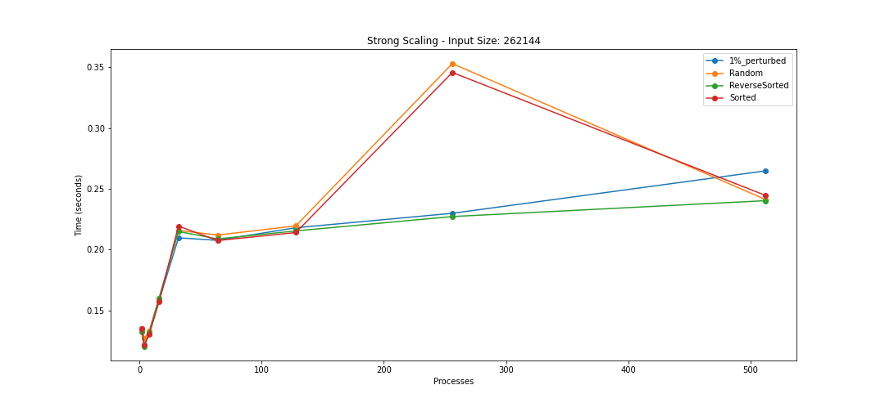
</div>

In this plot, we see a similar pattern as the 2^16 array, where there is a sharp increase until 32 processes and then a plateau. This time, the 1% perturbed and reverse sorted lines become steady, while the random and sorted lines are spiking at 256 processes. These irregularities could be because the input size is still relatively small, so the parallelization overheads are still outweighing the advantages of having more processes. However, we are beginning to see the data points stabilize as we increase the array size.

<div style="background-color:white; padding:10px;">
  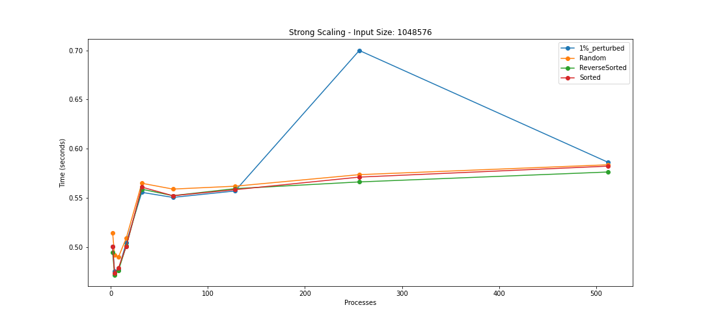
</div>

This shape of this plot is similar to the ones above, where we have an initial dip in runtime, then a plateau at 32 processes, and stable runtime after that. This time, only the 1% perturbed line spikes at 256 processes and the others lay almost on top of each other. Reverse sorted has the lowest runtime followed closely by sorted and random. We can see the benefits of parallelization more and more as we increase input size. However, there is still significant communication and process synchronization overhead, where processes must wait for others to finish before continuing.

<div style="background-color:white; padding:10px;">
  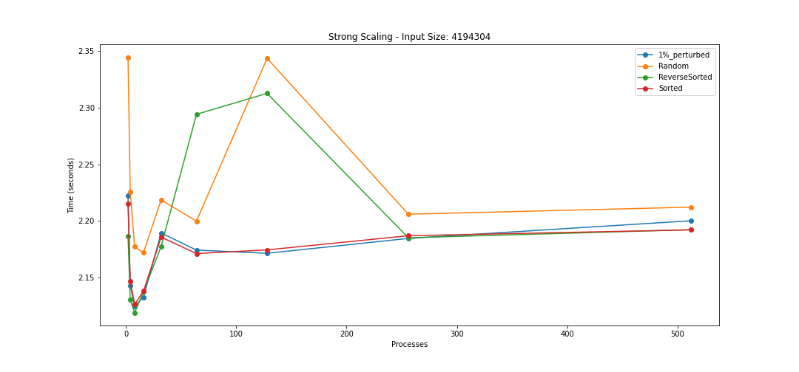
</div>

In this plot, we see significant runtime with only two processors, which dips exponentially until 32 processors, where the trendlines once again become a bit erratic. Random and reverse sorted data spikes and then stabilizes at 256 processes, joining the other two trendlines. At 2 processes, the amount of parallelization for such a large array is limited, which would explain the high overhead initially. The spike with more processes could be explained by synchronization overheads or resource contention to name some possible reasons. Overall, we see that as we increase the input size, the more parallelization we see in the plots.

<div style="background-color:white; padding:10px;">
  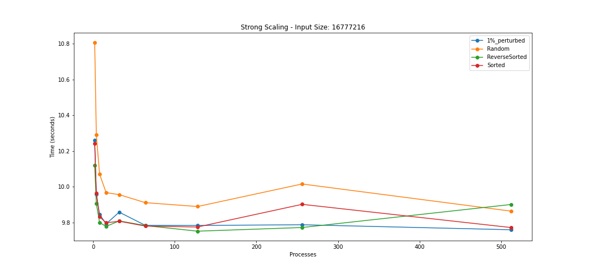
</div>

As we increase the input size to 2^24, we see the plot takes the shape of an exponentially decreasing graph, but is still erratic with larger processes. We see very high runtimes with 2 processes (each process is handling a very large portion of the input size), and the runtimes generally decrease as we add more processes. This is because each process now has less data distributed to it, which reduces time spent on calculating and communicating large chunks of data, thus leading to faster runtimes. However, we still see the effects of parallelization overhead in the slightly unstable runtimes of the larger processes.

<div style="background-color:white; padding:10px;">
  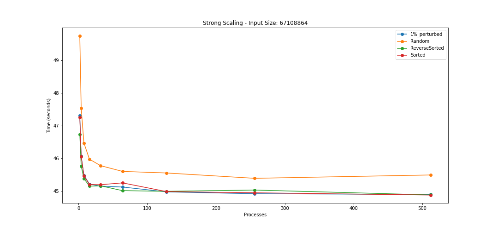
</div>

This plot is similar to the one above but appears smoother due to the larger input size. With a greater amount of data, the beneficial effects of parallelizing the sorting algorithm become more pronounced, as the workload is more manageably distributed across processes. However, random input still takes noticeably more runtime than the other inputs, which are nearly stacked on top of each other. This may be because of the partitions of randomly sorted data chunks. Since the data is not sorted in any way, processes will handle different amounts of work, leading to increased communication and synchronization overhead with increased data exchanges on some processes.

<div style="background-color:white; padding:10px;">
  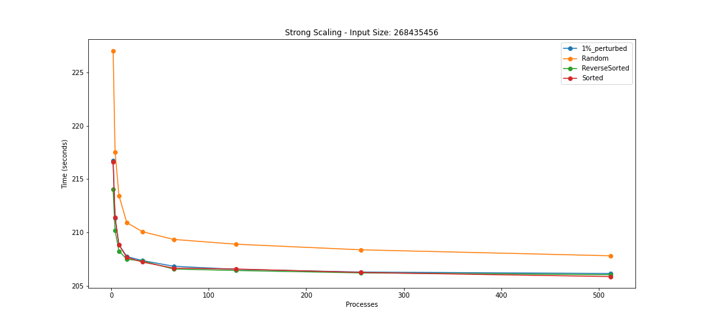
</div>

With this plot, all the lines show smooth exponentially decreasing trends. This clearly outlines the algorithm sorting very large input in parallel. We start with significant runtime at 2 processes, which decreases drastically as we add more processes. The sheer amount of data needed to be calculated and communicated by 2 processes contributes to the large initial runtimes, but as the workload is distributed over more processes, the execution times become faster. Here, we see the advantages of parallelization outweigh its overheads. The random takes up more runtime for the same reason as listed in the above graph.

### Strong Scaling - Speedup

<div style="background-color:white; padding:10px;">
  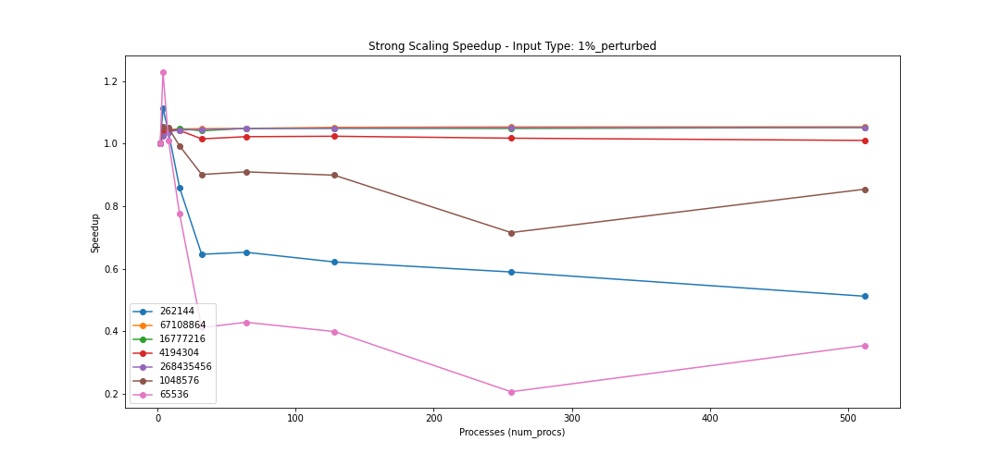
</div>

Speedup for 1% perturbed arrays is most noticeable with the largest input sizes. In the plot, the lines for the three largest arrays are almost identical, indicating that the algorithm scales more effectively for these input sizes, causing greater speedup. This is closely followed by the fourth-largest array, which also benefits from efficient parallelization. The speedup is more unsteady and smaller for the three smallest array sizes. This is because of the overhead from communication and process synchronization. As a result, the parallelization is less effective, leading to more variability and lower speedup for smaller arrays.

<div style="background-color:white; padding:10px;">
  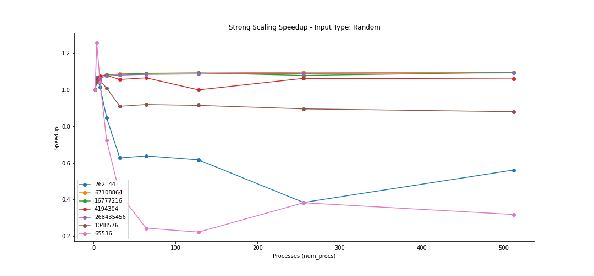
</div>

The speedup graph for random is mostly similar to the one above. Speedup is most noticeable with the largest input sizes, shown by the plot. The three largest arrays have almost identical speedup trends, indicating that the algorithm scales more effectively for these input sizes. This is closely followed by the 2^22 array, which also benefits decently from efficient parallelization. The speedup is less pronounced for the three smallest array sizes because of the overhead from communication and process synchronization. As a result, the parallelization is less effective, leading to more variability and lower speedup for smaller arrays.

<div style="background-color:white; padding:10px;">
  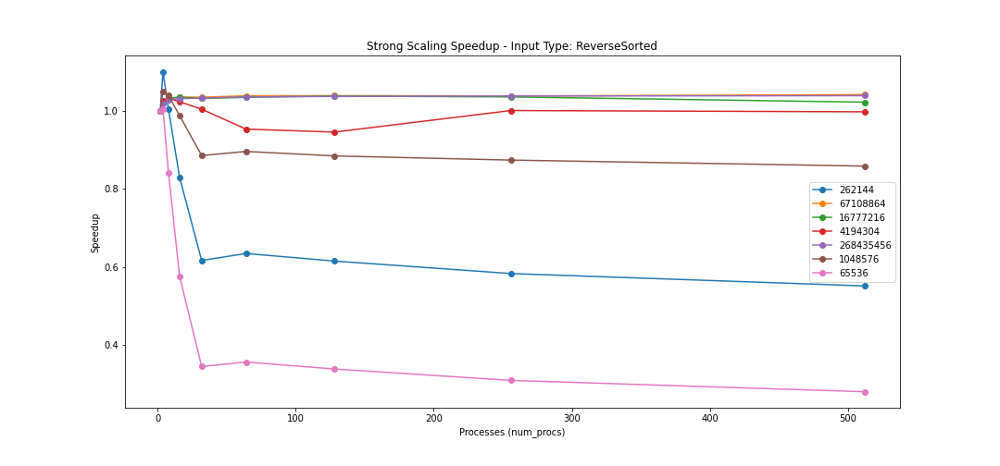
</div>

This plot appears much more constant after the initial dip in speedup, which could be because this type of data is more predictable for the sorting algorithm. Outside of that, we see very similar trends in speedup for the different arrays. Once again, the speedup trends for the three largest arrays are almost identical, meaning the algorithm scales more effectively for these input sizes. This is closely followed by the fourth-largest array, which also receives decent speedup as we increase the number of processes. The speedup becomes less pronounced for the three smallest array sizes. The delaying effects of overhead from communication and process synchronization show, and the parallelization is therefore less effective.

<div style="background-color:white; padding:10px;">
  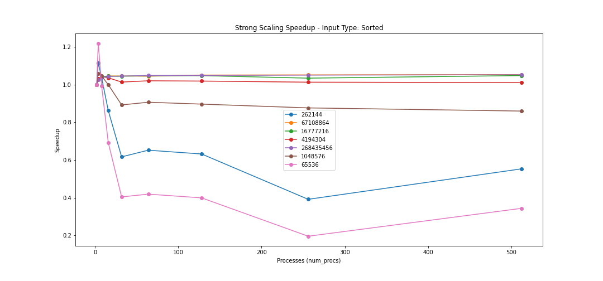
</div>

Speedup for sorted arrays of different input sizes is greatest with the larger sizes, meaning parallelization is most effective for them. As reflected in the graph, the lines for the three largest arrays almost completely overlap and all have the greatest speedup. This is closely followed by the fourth-largest array, which also benefits from efficient parallelization. The speedup is less pronounced for the three smallest array sizes because there is decent overhead from communication and process synchronization. As a result, the parallelization is less effective, leading to more variability and lower speedup for smaller arrays.

### Weak Scaling

<div style="background-color:white; padding:10px;">
  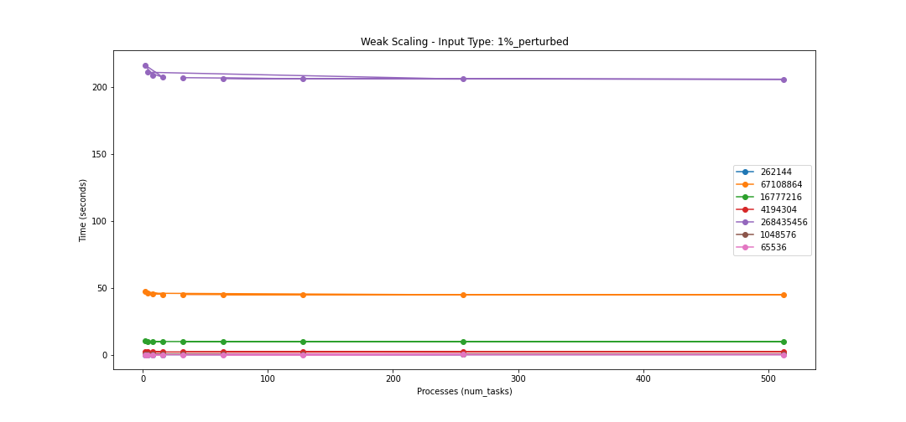
</div>

This graph shows constant lines for all the array sizes. The four smallest arrays are almost identical in terms of runtime. They are closely followed by 2^24 input size, followed less closely by 2^26, and decently far away from 2^28. For weak scaling, this means the algorithm is maintaining performance and the time remains relatively stable as we scale upwards.

<div style="background-color:white; padding:10px;">
  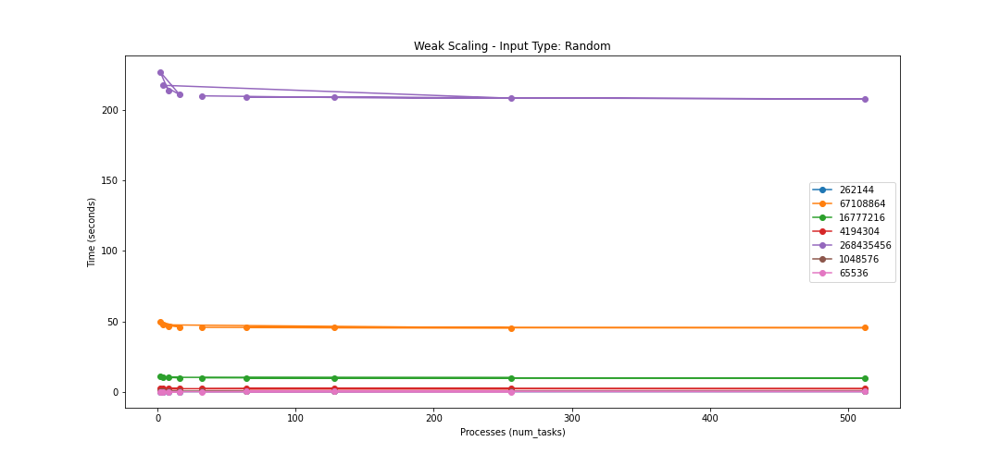
</div>

This graph displays constant lines across all array sizes. The runtimes for the four smallest arrays are nearly identical, with the 2^24 input size closely following. The 2^26 size follows at a slightly greater distance, and the 2^28 size shows a more significant gap. The execution times remain relatively stable as we increase the workload, indicating good scalability, but larger input sizes still face overhead with communication and synchronization.

<div style="background-color:white; padding:10px;">
  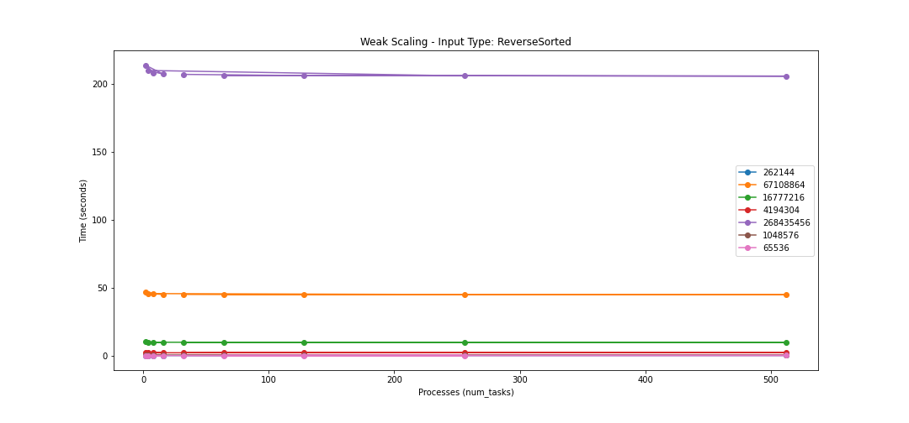
</div>

The runtimes for the four smallest arrays greatly overlap, followed by the 2^24, 2^26, and 2^28 input size. As the workload increases, the execution times remain relatively stable, demonstrating good scalability. However, larger input sizes still experience parallelization overhead because of communication and synchronization, among other factors.

<div style="background-color:white; padding:10px;">
  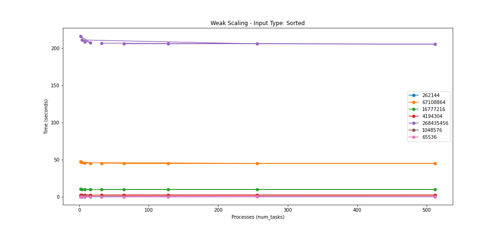
</div>

All the array sizes behave fairly similarly as more processes are added. They stay constant, with the only primary difference being their runtimes. The 2^16 to 2^22 trendlines are nearly the same. They are closely followed by 2^24 input size, followed less closely by 2^26, and decently far away from 2^28. As the workload increases, the execution times remain relatively stable, demonstrating good scalability, but larger input sizes still face noticeable overhead with communication and synchronization.

- Radix Sort:

### Strong Scaling - Input Sizes

<div style="background-color:white; padding:10px;">
  
</div>

The plot shows that for a very large input size, increasing the number of processes initially reduces computation time significantly, but beyond 100-200 processes, the benefits taper off. This is likely due to communication and synchronization overheads, which will start to outweigh the advantages of adding more processors. Past this point, performance stabilizes or worsens (but very slightly), indicating that further increases in the number of processors offer diminishing returns. The different input types show similar performance patterns, suggesting that for large inputs, the sorting state of the data doesn't really impact scalability.

<div style="background-color:white; padding:10px;">
  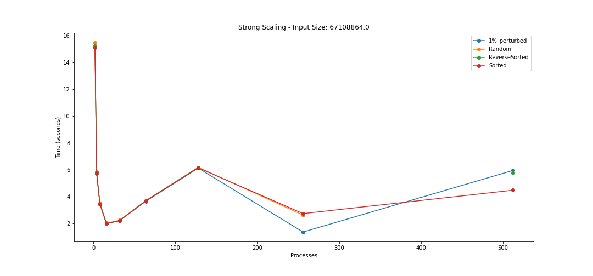
</div>

This graph exhibits a similar pattern to the above graph. Increasing the number of processes initially reduces computation time significantly, but beyond 100-200 processes, the benefits taper off. This is likely due to communication and synchronization overheads, which will start to outweigh the advantages of adding more processors.
However, 1% perturbed does have a slighter higher execution time at the highest processor count. This could be due to increased irregularity in the distribution of the data.

<div style="background-color:white; padding:10px;">
  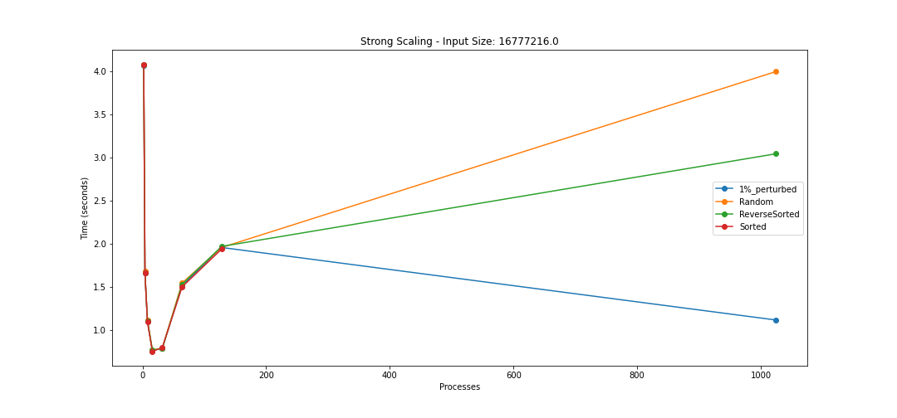
</div>

This graph shows a significant decrease in overall computational time beyond processors 2-16. However, with more processors beyond that count, the benefits increasingly taper off. This is likely due to overwhelming communication and synchronization overheads. These factors can cause certain input types to become less efficient as more processors are used.
Interestingly enough, 1% perturbed comes out as the winner with the highest number of processors with the lowest execution count, while random has the largest computational time.

<div style="background-color:white; padding:10px;">
  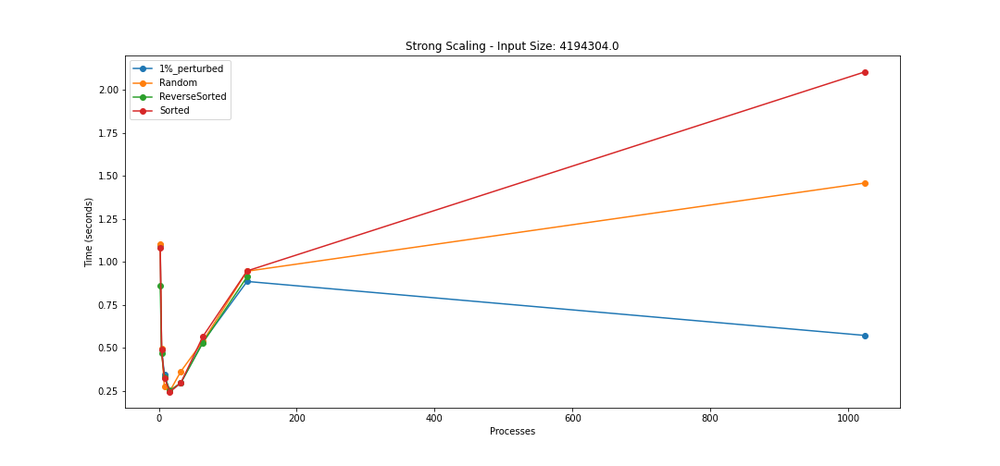
</div>

Similar to the previous graph, this graph shows a significant decrease in overall computational time beyond processors 2-16. However, with more processors beyond that count, the benefits increasingly taper off. The points at which the different algorithms start to see diminishing returns differ very slightly, compared to the graph above. This is likely due to overwhelming communication and synchronization overheads. 
This is more clearly shown that these factors can cause certain input types to become less efficient as more processors are used. 

<div style="background-color:white; padding:10px;">
  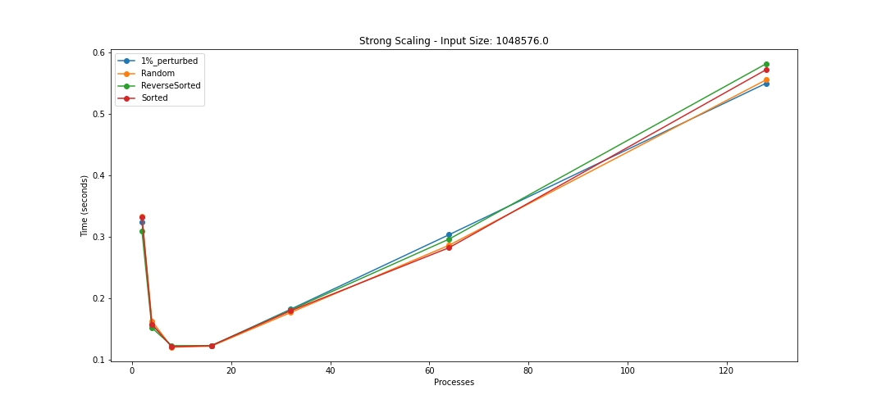
</div>

Similar to the previous graph, this graph shows a significant decrease in overall computational time beyond processors 2-8.

<div style="background-color:white; padding:10px;">
  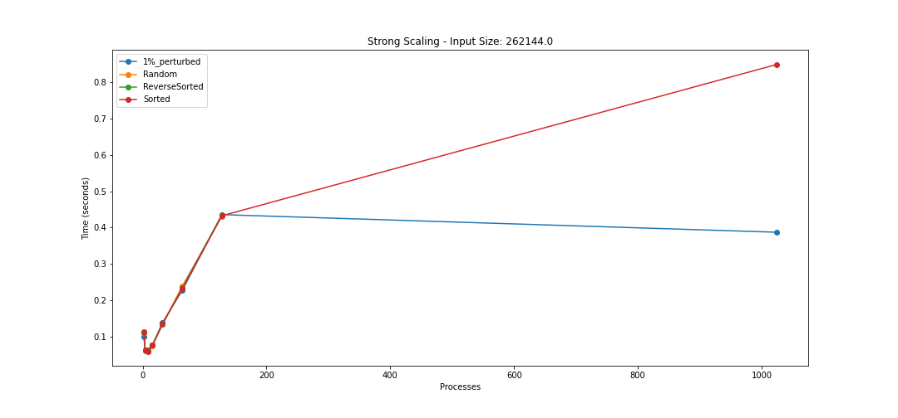
</div>

Similar to the previous graph, this graph shows a significant decrease in overall computational time beyond processors 2-4.


<div style="background-color:white; padding:10px;">
  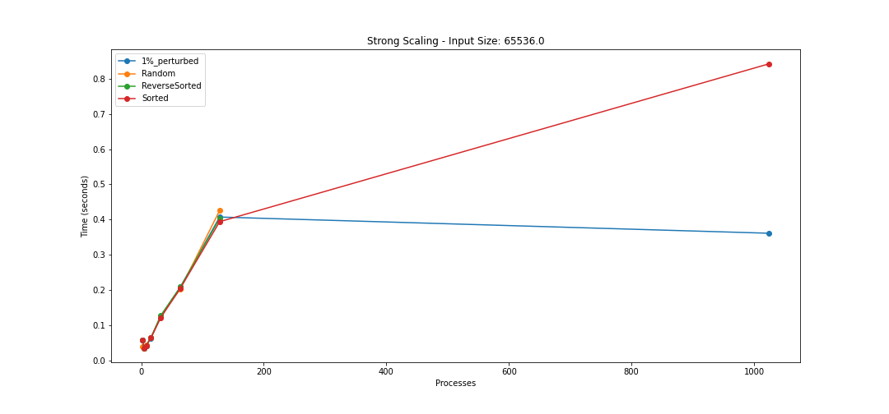
</div>

Similar to the previous graph, this graph shows a significant decrease in overall computational time beyond processors 2.

Overall, the analysis of the strong scaling in regards to input size shows how, with smaller input sizes, there are diminishing returns (and even detrimental effects due to the increased overhead of processor communication and synchronization overheads) as processors are scaled up.

### Weak Scaling

<div style="background-color:white; padding:10px;">
  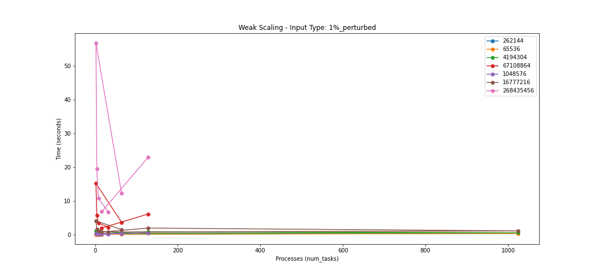
</div>

<div style="background-color:white; padding:10px;">
  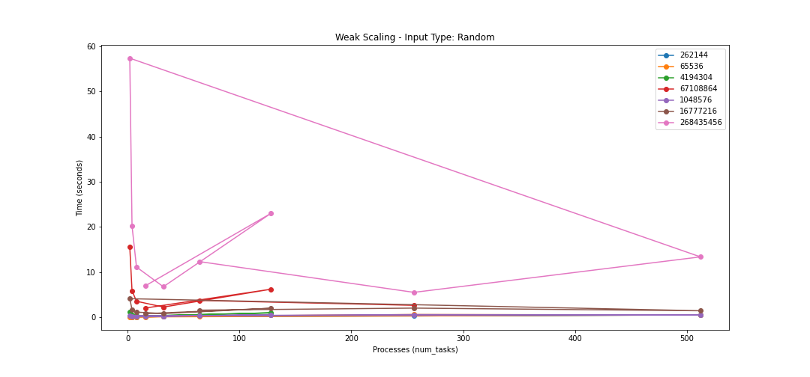
</div>

<div style="background-color:white; padding:10px;">
  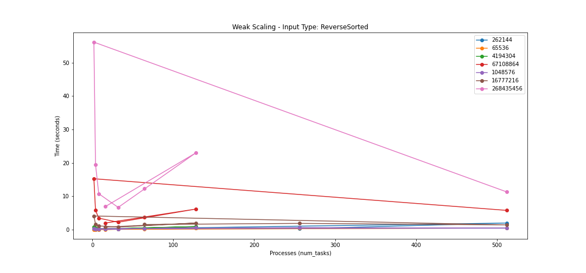
</div>

<div style="background-color:white; padding:10px;">
  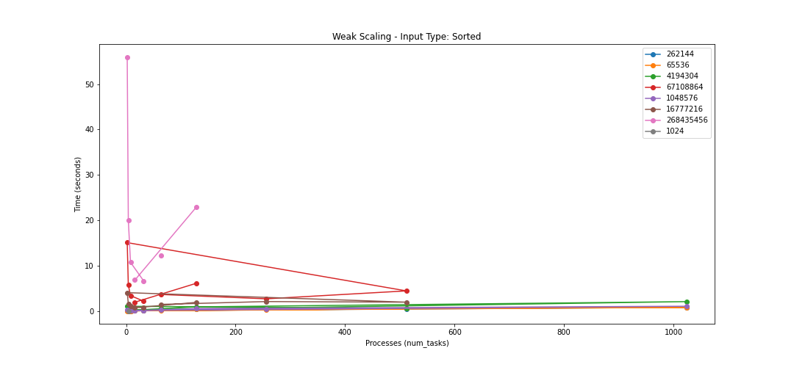
</div>

Overall:
For smaller input sizes, the time remains relatively stable as the number of processes increases, indicating good scalability. However, for the larger input sizes (like 67108864 and 268435456), there is an initial spike in execution time, which then declines as the number of processes increases. This suggests while smaller input sizes scale efficiently, larger input sizes face more significant overhead at least initially, likely due to communication and synchronization costs. As more processes are added, this overhead reduces, though the larger inputs still take longer to process compared to smaller ones.

The trend persists across the different input types.

### Strong Scaling - Speedup

<div style="background-color:white; padding:10px;">
  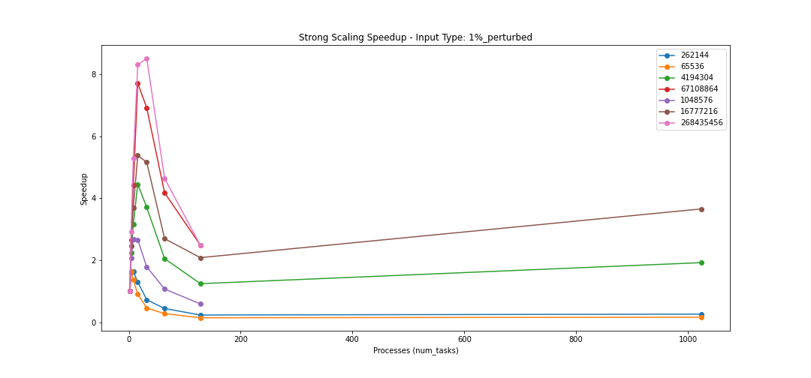
</div>
In this plot, strong scaling seems effective up to a certain number of processes, after which the overhead of coordination reduces the speedup, particularly for smaller input sizes. Larger input sizes maintain better scalability, but still diminished speedup as they continue to benefit from additional processors.

<div style="background-color:white; padding:10px;">
  
</div>
Similar to the above, in this plot, strong scaling seems effective up to a certain number of processes, after which the overhead of coordination reduces the speedup, particularly for smaller input sizes. Larger input sizes maintain better scalability, but still diminished speedup as they continue to benefit from additional processors.

<div style="background-color:white; padding:10px;">
  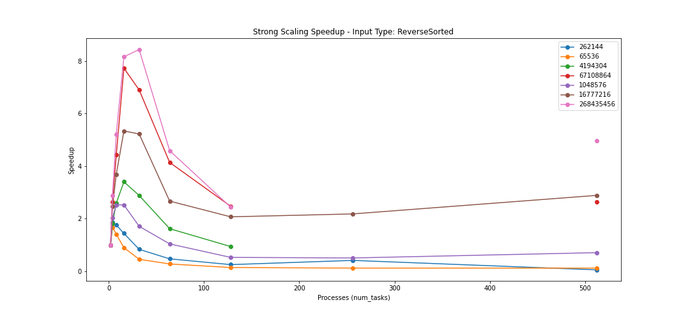
</div>

Similar to the above, in this plot, strong scaling seems effective up to a certain number of processes, after which the overhead of coordination reduces the speedup, particularly for smaller input sizes. Larger input sizes maintain better scalability, but still diminished speedup as they continue to benefit from additional processors.

<div style="background-color:white; padding:10px;">
  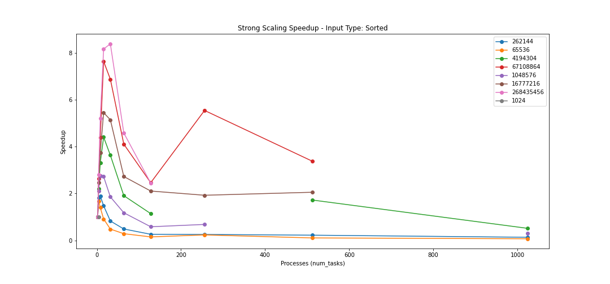
</div>

Similar to the above, in this plot, strong scaling seems effective up to a certain number of processes, after which the overhead of coordination reduces the speedup, particularly for smaller input sizes. Larger input sizes maintain better scalability, but still diminished speedup as they continue to benefit from additional processors.

Overall, random seems to benefit the most when increasing processors up to a certain amount, and has a higher processor count allowed before the speedup starts to weaken and decrease. Sorted has a steep dropoff in speedup very early on in processor count. 

- Merge Sort:

Strong Scaling Plot for 2^16:
  <p align="left">
  
</p>
  	Generally, looking at the smallest input size of 2^16 for strong scaling, the performance seems to decrease in strong scaling efficiency as the number of processors increase. The performance seems to spike at around 400 		processors specifically for sorted input which could be due to some inefficiency or anomalies in the communication or workload distribution. After 400 processors, the performance does improve with a downward trend before 		leveling out. As the problem size is small, dividing it across a large number of processors (after 400) could mean that each process is handling a small amount of work. Thus, creating a situation where communciation and 		synchronization overhead will dominate. For the other input types, the random, reverse, and perturbed seem to have a more gradual scaling but also starts to degrade as the number of processors increase, specifically after 		around 200 processors as the time starts to rise quite steadily. Especially for small input sizes, the amount of work per process is relatively limited which dominates the synchronization costs. There could be a high 		synchronization overhead due to many processors working on the small problem. Also in the merging phase, the processors could need to wait for one another which could create larger times due to the smaller input size.

&nbsp;

  Strong Scaling Plot for 2^22:
  <p align="left">
  
</p>
  	This graph contains the strong scaling for the input size of 2^22. Here, the degradation is more subtle than the 2^16 graph with the performance being stabilized after 200 processors. There are initial spikes before 200 		processors. However, even after the spikes, there is still a general increase as more processors are added which suggests that there could be more communication overhead. Synchronization could also be a issue when 			introducing more processors because the synchronization between the processors will add an layer of overhead. With more processors, the merging phase requires the processors to exchange their results and ensures that the 		merges are done in a specific order which will increase communication and synchronization costs.  Specifically for random input in processors before 200, there is instability being shown. The spikes should suggest that 		communication or data partitioning was inefficient and even after flattening out, the system does not gain much more speedup as the increasing amount of processors may add more overhead than what is saved in computation 		time. Moreover, the random input type data could be higher due to the load imbalances that are caused by the unpredictable nature of random data which could also make it harder to distribute the workload more evenly.

&nbsp;

  Strong Scaling Plot for 2^28:
  <p align="left">
  
</p>
	This graph contains the strong scaling for the input size of 2^28. Here, there is less degradation as the larger input size allows for each process to handle more work so communication and computation ratio should be good. 		However, there seems to still be instability specifically at the spike before 200 processors especially for random input data which could be due to the unpredictable nature of random data. Even with improvement, after 200 		processors the trend starts to become constant which could mean that the synchronization costs start to outweigh the computational benefits of adding more processors. Therefore, additional processors do not significantly 		reduce overall time as they could be waiting on one another specifically in the merge phase.

&nbsp;

  Strong Scaling Speedup for 1%Perturbed:
    <p align="left">
  
  </p>
  	This graph is describing the strong scaling speedup for the 1% perturbed imput type. For the smaller processors, it seems that the speedup is a lot higher. The speedup seems to start off at 6 for the smallest input size 		which 	suggests that the parallelization should be working fine initially. Merge sort should be able to provide a substantial speedup early on when the input size is small and division of work is efficient. However after 		around 100 processors, the speedup starts to flatten out or degrade for all the input sizes, hovering at around 1.5 and 2 speedup for the larger input sizes. For the smaller input sizes, the speedup does drop quite sharply 		because the work per process becomes very small so synchronization/communication overhead can begin to dominate the runtime. In the larger input sizes, the speedup does remain quite constant at around 2 as the number of 		processors increase. This should suggest that there is pretty good speedup at the larger inputs. The flattening out of speedup could be because of the synchronization costs during the merging for merge sort. With the 		increase in input size, each merge should require more and more synchronization between processors, which could limit further speedup.


&nbsp;

  Strong Scaling Speedup for Random:
  <p align="left">
  
</p>
  	For this strong scaling speedup graph, the input type used is random and we see that it behaves quite similarly to the perturbed input graph, where the smaller input sizes are also able to show high speedup at around 7 with 	a small number of processors. Once again, the high initial speedup should be expected as merge sort should be able to easily parallelize the sorting phase when inputs are randomly distributed. However, when the number of 		processors start to grow, synchronization and communication costs increase which are shown in the trend in the graph. After around 100 processors, the speedup drops across all input sizes, with a particularly noticeable 		decrease for smaller inputs, where the speedup falls to around 1.5 or lower as the number of processors continues to increase. Quite similar to the perturbed input, the random input data also experiences significant load 		imbalance during the merging phase where some of the processors end up sitting idle, waiting for others to complete their merges. This could reduce the efficiency thus dropping the speedup. The larger input sizes do 		maintain better speedup than the smaller ones but still does not reflect the ideal condition of being linearly scaling with the increase in processors. This should show the communication bottlenecks which could be present 		in the 	merging phase which becomes more prominent as more processors are involved in merging random data.

&nbsp;

  Weak Scaling for 1%Perturbed:
  <p align="left">
  
</p>
	This graph is looking at the weak scaling for the input type of 1% Perturbed. We see that there is a spike in time in the smaller number of processors. This could be due to initial overhead when only a few processors are 		used to sort and merge large chunks of data. This could also indicate that the overhead of both communication and task distribution is relatively significant when the problem size and number of processors are small. After 		the initial spike, the time per rank stabilitizes for all input sizes as the number of processors increase. This should indicate that once the system has enough processors to distribute the work efficiently, the execution 		time per process will start to stay constant even as input size and processors increase. This should suggest that there is pretty good weak scaling since the execution time does not really increase as the number of 			processors increase. This could be as this input type does not have much variability with weak scaling once the initial overhead is done. Both the sorting and the merging phases are distributed quite well across the 		processors.

&nbsp;

  Weak Scaling for Random:
  <p align="left">
  
</p>
  	This graph is quite similar to the perturbed one, the random input type also has a similar spike when there are few processors being used. This seems to be fairly reasonable as with fewer processors, the communication and 		synchronization overhead should be higher relative to the computational work which should cause that initial spike. After that spike, as the number of processors increase, it seems to be stabilized regardless of the input 		size. This should indicate good weak scaling performance, as the algorithm is able to effectively distribute its workload and handle all the communication overhead with the increase in processors. The random input type does 	not seem to cause an issue for weak scaling, once the number of processors start to increase beyond that initial spike, the time stabilizies which should indicate efficiency.

&nbsp;

- Sample Sort:

### Strong Scaling 
For strong scaling, six plots were chosen to emphasize the relationship between time and the number of processors. For each of the plots, we observe how increasing the number of processors for a specific size affects the max time/rank. We keep the size constant while examining different input types and the large computation and communication regions as the number of processors increases. For the time, we specifically chose max time as this often represents the worst-case scenario, which will help to identify bottlenecks since the slowest processor or task will slow down the total time for the algorithm. 

Strong Scaling for Comp Large (2^16)


We first begin by examining strong scaling for the large computation region. For our smallest array size 65536 (2^16), we first observe a sharp decrease as we increase the number of smaller processor sizes (2-64). This indicates that adding more processors initially leads to a significant reduction in the large computation time. This makes sense as with more processors, more tasks can be performed at once, speeding up the computation. However, after the initial drop, there is some fluctuation and then a relatively constant trend between 128 and 1024 processors. This suggests diminishing returns on adding more processors. As such, the system begins to see more inefficiencies when increasing the number of processors. As such, from a certain point onward, adding more processors may be unnecessary and suboptimal, as it will not improve the computation efficiency. We also note that the sorted input type plots at a higher time than the other input types. This seems unusual as you would expect an already-sorted graph to take less time. However, the data already being sorted can lead to unnecessary comparisons and load imbalances that lead to more bottlenecks contradicting the potential time decrease from not having to swap data.


Strong Scaling for Comp Large (2^24)


Similar to the other graph, we examine strong scaling for a constant size. For this graph, we observe a 16777216 (2^24) sized array which we categorize as one of the mid-sized arrays in this experiment. For this size, we once again note a sharp decrease in the beginning with the smaller numbers of processors. After around 64 processors, this remains relatively constant with some slight fluctuations. However, once we move from 512 to 1024 processors, we notice a visible increase in the large computation times. Once again, from the data, we understand that there is an optimal number of processors, where any number beyond that is unnecessary and inefficient likely due to load imbalances and coordination inefficiencies that occur with larger numbers of processors. Also, we note that for this graph the input type does not have much impact as the values are mostly the same with the random data being slightly higher as we move from 512 to 1024 processors. This implies that the algorithm handles all types of inputs in a fairly uniform manner. This could indicate that the algorithm’s performance is not highly sensitive to the distribution or order of the input data, meaning it is well-optimized for different data types across this input size.

Strong Scaling for Comp Large (2^28)


Lastly, for the large computation, we examine the largest-sized array (2^28) as we increase the number of processors. Similarly to the other two graphs we once again observe a sharp decrease at the beginning that declines to become more stable. However, for the largest size, we notice that the lines don't seem to increase as much as the middle-sized array, highlighting the tradeoff between more processors for larger data sizes and more bottlenecks and inefficiencies with increasing the number of processors. We also note that the input sizes are even closer together than before, emphasizing that with a larger data set, the algorithm’s performance is less dependent on the type of input. This is because the larger problem size may balance out any minor variations due to input type, and the computation time overshadows sorting inefficiencies related to specific input characteristics.

Strong Scaling for Comm (2^16)


We now observe strong scaling for the communication maximum time/rank with constant sizes against varying numbers of processors. We start with (2^16). Our main observation for the communication time highlights the idea that as the number of processors increases, the communication time increases. This makes sense as with more processors there will be more communication overhead due to having to communicate the samples and buckets with other processors for sample sort. Therefore, with more processors, there will be more buckets and samples to process with the all-to-all mpi command. Similar to the computation times, there is not much variation in input type until we move from 512 to 1024 processors. This indicates that the algorithm handles different input types similarly up to a certain number of processors. This could be explained by effective load balancing and efficient handling of parallel tasks. However, the slight variation between input types from 512 to 1024 processors suggests that communication overhead or inefficiencies will become more prevalent at higher processor counts. As the number of processors increases, the differences in input types may slightly affect how data is distributed and processed.

Strong Scaling for Comm (2^24)


Similarly to the first communication graph, there is a noticeable increase as we increase the number of processors, introducing more communication overhead. However, in the beginning, we observe a sharp decrease across the smaller number of processors. This indicates that adding more processors initially reduces the communication time, as the workload is distributed across more processors, leading to less data being handled by each processor. As such, initially, the communication time reaches a low point and the benefits of parallelism outweigh the cost of coordinating between processors, which results in a sharp decrease. However, as the number of processors increases, communication overhead starts to dominate, meaning the time spent coordinating and exchanging data between processors grows. We also notice that the random and sorted input types are visibly smaller than the reverse sorted and 1%_perturbed types. As such, we understand that with sample sorting for this array size (2^24), there are fewer irregularities in the workload distribution. 

Strong Scaling for Comm (2^28)


This graph does a 180 from the other increasing trend communication graphs. With this size (2^28), we observe a sharp decrease and then a relatively constant to increasing trend. Unlike the other graphs where increasing the number of processors sharply increases the time, the time only slightly increases when moving from 512 to 1024 processors. This is typical of strong scaling, where adding processors reduces the workload, leading to faster communication at smaller numbers of processors. During this phase, the communication overhead is low, and the benefits of adding processors are more noticeable. However, after the sharp decline, the graph becomes relatively more stable. This indicates that communication time remains relatively constant in this range, suggesting that the system is balanced and efficient at a certain optimal number of processors, which may be unnecessary to go beyond. Beyond 512 processors, there’s a gradual increase in time. This suggests that communication overhead begins to dominate with higher numbers of processors. As more processors are introduced, the communication between them becomes more complex and the time spent on coordinating data exchanges increases. Also, we note that the input types are quite similar in time, showing few irregularities in workload distribution regarding the input type.

### Strong Scaling Speedup

Strong Scaling Speedup for Comp_large (Sorted)


This plot shows a strong scaling speedup for the large computation region with sorted input across various array sizes. Initially, there's a sharp increase in speedup, particularly for larger arrays. This makes sense as with initially adding more processors there will be a sharp improvement in performance, especially with more data being processed. However, as the number of processors grows beyond 512, we see diminishing returns. For smaller arrays, the speedup stabilizes around 5 to 10 times, indicating limited benefits from additional processors due to challenges with workload distributions and computation inefficiencies. Larger arrays (like 2^24 and 2^28) achieve higher speedups, peaking around 25 times, but eventually, delays reduce efficiency, causing speedups to decline around 1024 processors. This indicates that with too many processors beyond an optimal point, performance will no longer improve.

Strong Scaling Speedup for Comp_large (Random)


With random input, we notice a slight decrease in the speedups, indicating that the performance slightly decreases with randomized data. This makes sense, as with more data to swap there will be more functionality to review for performance. Similar to the sorted graph, there's a sharp increase in speedup, particularly for larger arrays. This once again shows that initially adding more processors significantly improves performance. However, after a certain optimal point particularly 512 processors, the performance does not improve and remains stagnant, indicating that with more processors there will be more computational inefficiencies to account for. 

Strong Scaling Speedup for Comm (Sorted)


We now examine the speedup for communication for constant sizes while increasing the number of processors. Each of the array sizes has a similar trend. We first note an increase initially similar to the large computation region. This indicates that initially there will be a significant improvement in communication performance when first adding more processors. However, this begins to decline at a specific point, seemingly around 128 processors, as adding more processors will introduce more communication overhead since there will be more buckets and samples to distribute in the all-to-all mpi communication. As such, at a certain point, increasing the number of processors will decrease the performance of the algorithm regarding communication. 

Strong Scaling Speedup for Comm (Random)


With the randomized plot, we observe that there is not much difference between input types regarding communication performance. As such, we understand that input type does not necessarily strongly affect communication performance as with any input type there will still need to be sample processing and buckets. In this plot, we continue to note the same trend as the previous with an initial increase in speedup or improvement in performance. This then begins to decline as we introduce more processors, leading to more communication overhead, and therefore a decline in performance.

### Weak Scaling 

Weak Scaling for Comp_large (Sorted)


We now observe the large computation maximum time/rank in the same way that we observed the communication maximum time/rank. The graph starts with an initial decline when we first introduce the smaller processor counts. This indicates that parallelism will indeed lead to a decrease in the computation time, as with more processors the sorting of arrays is faster. However, past a certain number of processors, we see that the time seems to remain relatively constant, indicating that as we increase the number of processors, there is a tradeoff between faster processing and computational inefficiencies like load imbalances between processors that lead to a stagnant time. As such, there is an optimal number of processors, which keeps a good balance between the two. However, past this, adding more processors will be unnecessary and inefficient. We also note that as the array sizes increase, the computation time will also increase. This makes sense, as with larger data sizes to process, there will be more data to sort, therefore taking more time.

Weak Scaling for Comp_large (Random)


For a random input type, we notice the same trend as with the sorted input type, indicating that there is not much significance of the input type on computation performance with increasing array sizes and processors. This could once again indicate that there are uniform workload distributions regardless of the input type. Also, for the same reasons as listed above, we first observe a sharp decline when introducing the smaller processor counts which then seems to remain relatively constant as the number of processors increases. Similar to the sorted graph, there is also an increase in the computation time as we increase the size of the array.

Weak Scaling for Comm (Sorted)


We now move on to weak scaling for communication. As such, we examine how the communication maximum time/rank is influenced by both an increase in the array size and the number of processors. Initially, for all array sizes, there is a sharp decrease with a smaller number of processors. This indicates that with a smaller number of processors, there will be faster communication. However, when we move past 512 processors, we notice a slight increase in all the array sizes as there will be more communication overhead with more processors as explained in the analysis for the graphs above. We also note that with larger arrays, there will be more communication overhead as we see from the increases in time as we increase the array sizes. This is likely a result of the fact that with larger array sizes, there are more samples to communicate as well as more values to process into each bucket. 

Weak Scaling for Comm (Random)


We first note that there is not much difference in the random and sorted graphs. As such we observe that the input type does not strongly influence communication. This indicates that there are not many irregularities caused by different workload distributions. We also note that the data seems to have the same trends as the sorted graph. For the reasons listed in the prior analysis, we notice that communication time increases as we increase the number of processors and array sizes, and initially declines when we introduced the first processor counts.

## 5. Presentation
Plots for the presentation should be as follows:
- For each implementation:
    - For each of comp_large, comm, and main:
        - Strong scaling plots for each input_size with lines for input_type (7 plots - 4 lines each)
        - Strong scaling speedup plot for each input_type (4 plots)
        - Weak scaling plots for each input_type (4 plots)

Analyze these plots and choose a subset to present and explain in your presentation.

## 6. Final Report
Submit a zip named `TeamX.zip` where `X` is your team number. The zip should contain the following files:
- Algorithms: Directory of source code of your algorithms.
- Data: All `.cali` files used to generate the plots seperated by algorithm/implementation.
- Jupyter notebook: The Jupyter notebook(s) used to generate the plots for the report.
- Report.md
