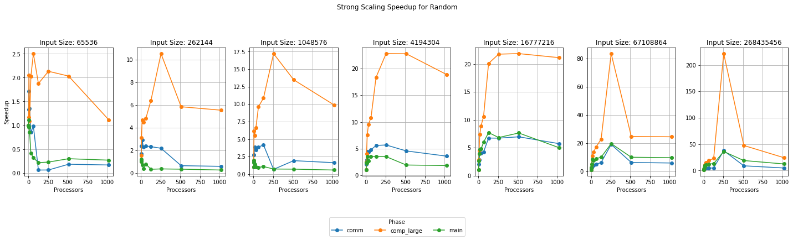
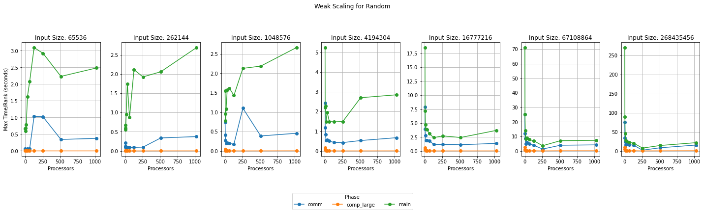

# CSCE 435 Group project

## 0. Group number: 20

## 1. Group members:
1. Victoria Chen
2. Arielle Shaver
3. Victoria Chiang
4. Bonnie Wu

We are using a group chat over text to communicate.

## 2. Project topic (e.g., parallel sorting algorithms)
Parallel Sorting Algorithms

### 2a. Brief project description (what algorithms will you be comparing and on what architectures)

- Bitonic Sort (Bonnie): 
- Sample Sort (Arielle):
- Merge Sort (Victoria):
- Radix Sort (Vic):

### 2b. Pseudocode for each parallel algorithm
- For MPI programs, include MPI calls you will use to coordinate between processes
- Radix Sort:
```
// Initialize MPI
MPI_Init()
Get the number of processes (n_procs)
Get the rank of each process (rank)

// Main process (rank 0), read and distribute the data
if rank == 0 then
    Read the input array
    Split the input data into n_procs parts
end if

// Scatter the data to all processes given the main process of 0
MPI_Scatter(data, local_data, root=0)

// For each digit LSD to MSD:
for each digit in LSD to MSD do
    // Count the frequency of each digit in the local data
    local_histogram = calculate_histogram(local_data, digit)
    
    // Share and combine all local histograms to create a global histogram
    global_histogram = MPI_Allreduce(local_histogram, MPI_SUM)

    // Use the global histogram to figure out where data needs to go
    prefix_sum = calculate_prefix_sum(global_histogram)
    
    // Exchange data between processes based on prefix_sum
    MPI_Alltoallv(local_data, send_counts, recv_counts, sorted_data)

    // Update local data with the received sorted data
    local_data = sorted_data
end for

// Gather all the sorted data back to process 0
MPI_Gather(local_data, sorted_array, root=0)

// Finalize MPI (clean up and end the program)
MPI_Finalize()

```
- Merge Sort:
```
    Main:  
        1. Initialize MPI - MPI_Init()
            a. MPI_INIT(&argc, &argv)
        2. Rank and size of MPI COMM_WORLD
            a. MPI_Comm_rank, MPI_Comm_size
        3. If rank == 0 then: read in the input array, split the input array into the number of processes part
            a. Use a fixed array for sorting so it is the same across all different types of sorting 
            b. no variable is our size of array 
        4. Broadcast that size of array to all the processes using MPI_Bcast
            a. MPI_Bcast(no, 1, MPI_INT, 0, MPI_COMM_WORLD)
        5. Find the size of each subarray for each of the process: subSize = no  / world size (from mpi_comm_size)
        6. Allocate a memory for each process’s subarray with subSize
        7. Scatter the original array into all the subarrays
            a. MPI_Scatter()
        8. Allocate temp array for merging with subSize
        9. Every process will perform merge sort on its own subarray 
            a. mergeSort(subarray, temparray, 0, subSize-1)
        10. Root process - gathers all the sorted subarrays 
            a. World rank is 0, we want to make a sorted array with the size of the array (no)
        11. Perform MPI_Gather to grab all the sorted subarrays from all the processes 
        12. Final merge with the root process so world rank is 0, create another array with the no variable size and use mergeSort function
        13. Add a print statement that prints out the sorted array to check 
        14. Free any memory and finalize the MPI environment: MPI_Finalize()


    Merge Function: * merge two sorted halves of one array into a complete sorted single array*
        1. Set lh= to the start index to the left half, set i= to the start index for the temporary array (temp array), 
            set rh= to the starting index of the right half (ending index of the first half + 1)
        2. While loop to start merging and compare the elements in both halves: * loop will finish after one half is processed* -> 
            While (lh <= ending index of first half && rh <= ending index of that array portion needed to sort)
                a. If current element array[lh] is <= to the current element in the right half so array[rh] we want to copy the array[lh] into the temp array at i and then increment the lh and the i
                b. Else we want to do the opposite so array[rh] to temp array at i and increment the rh and the i
        3. Remaining elements will be copied:
            a. If there are elements in the right half leftover or the left it will be copied into the temp array 
            b. Check the index and the end of side index to see if one side has been fully processed or not 
        4. Copy the sorted elements from the temp array all back to the original array
            a. using a for loop and the indexes 

    MergeSort Function: *recursive merge sort algorithm without impacting any MPI*
        1. Check if the starting index is less than the ending index of the array -> if LI < RI -> want to make sure the array 
            has more than one element
                a. Find the middle index: mid = (LI + RI) / 2, average of left and right index divided by 2
                b. Recursively call mergeSort so it can sort the left half -> LI to mid, left index to mid index 
                c. Recursively call mergeSort so it can sort the right half -> mid+1, RI, mid+1 index to right index
                d. Merge Function called so we can combine it into a single sorted array 
	
```
- Sample Sort:
```
Main Function:

    1. Get user input for data_type, size (total number of elements), and num_procs (number of processors).

    2. // Initialize MPI
       MPI_Init()  // Set up MPI environment for parallel processing
       task_id = MPI_Comm_rank(MPI_COMM_WORLD)  // Get rank of the current process (task_id)
       num_tasks = MPI_Comm_size(MPI_COMM_WORLD)  // Get the total number of processes available (num_tasks)

    3. // Check if there are enough tasks available
       If num_tasks < 2:
           Print "Need at least two MPI tasks. Quitting..."
           MPI_Abort(MPI_COMM_WORLD, error_code = -1)
           Exit program

    4. Set the number of buckets (m) = num_tasks  // m is the total number of processes, which will sort in parallel.
    
    5. // Synchronize all processes
       MPI_Barrier(MPI_COMM_WORLD)

    6. // Master Process
       If task_id == MASTER:
           Print "Parallel samplesort with master-worker has started with", num_tasks, "tasks."
           Print "Initializing data..."

           // Generate input data of specified data_type
           Generate size amount of input_data of type data_type 

           // Draw a sample of size s
           // Choose s based on some multiple of m (s = m * oversampling_factor)
           s = m * oversampling_factor
           Sample s elements from input_data  // Randomly select s elements for good splitter selection

           // Sort the sampled elements
           Sort the sampled elements using quicksort
           QuickSort(sampled_elements, length(sampled_elements))

           // Select m-1 splitters from the sorted samples
           Select the s/m, 2*(s/m), ..., (m-1)*(s/m) elements as splitters
           // These m-1 splitters will be used to partition the entire dataset into m buckets.

       // Broadcast the splitters to all processes
       MPI_Bcast(splitters, m-1, data_type, root=MASTER, comm=MPI_COMM_WORLD)

    7. // All Processes (Master and Workers)

       // Scatter the input data to all processes
       local_size = size / num_tasks  // Calculate the size of data each process will receive
       local_data = Array[local_size]

       MPI_Scatter(input_data, local_size, data_type, local_data, local_size, data_type, root=MASTER, comm=MPI_COMM_WORLD)
       // Each process now has its portion of the data to work on

       // Each process partitions its data into m buckets
       Local_buckets = Create m empty buckets for partitioning

       // Assign data to buckets based on splitters
       For each element in local_data:
           Determine the correct bucket for the element based on splitters
           Append element to the corresponding bucket in Local_buckets

       // Prepare data for sending to other processes
       // Convert Local_buckets to an appropriate structure for MPI_Alltoallv
       send_counts = [Number of elements in each bucket to send to each process]
       send_displacements = [Offsets for each bucket to be sent]

       // Use MPI_Alltoallv to exchange bucket data among processes
       recv_counts = [Number of elements to receive from each process]  // Allocate space for receiving bucket data
       recv_displacements = [Offsets for each received bucket]

       total_recv_size = sum(recv_counts)  // Total size of received data
       recv_data = Allocate array of size total_recv_size

       MPI_Alltoallv(Local_buckets, send_counts, send_displacements, data_type, recv_data, recv_counts, recv_displacements, data_type, comm=MPI_COMM_WORLD)
       // Each process now has all the elements that belong to its assigned bucket
       local_bucket = recv_data  // This is the bucket each process will sort

       // Sort the received bucket using iterative quicksort
       Print "Task", task_id, "sorting its bucket..."
       QuickSort(local_bucket, length(local_bucket))

    8. // Gather sorted buckets back to the master

       // Use MPI_Gather to gather all sorted buckets
       sorted_bucket_size = length(local_bucket)
       sorted_buckets = None
       If task_id == MASTER:
           sorted_buckets = Array[size]  // Master will gather all sorted data

       MPI_Gather(local_bucket, sorted_bucket_size, data_type, sorted_buckets, sorted_bucket_size, data_type, root=MASTER, comm=MPI_COMM_WORLD)

    9. // Master Process
       If task_id == MASTER:
           // Concatenate all sorted buckets to get the final sorted data
           Final_sorted_data = concatenate(sorted_buckets)
           Print "Parallel samplesort completed."

   10. // Finalize MPI environment
       MPI_Finalize()

End Main Function


// Iterative Quicksort Algorithm Function
QuickSort Function (arr, n):
    // arr: array to be sorted
    // n: size of the array

    Create an empty stack stack
    Push (0, n - 1) onto stack  // Push initial subarray (full range)

    While stack is not empty:
        // Pop high and low indices from stack
        (low, high) = Pop(stack)
        
        // Partition the array
        If low < high:
            // Choose the pivot element as the last element
            pivot = arr[high]
            i = low - 1

            // Rearrange elements based on pivot
            For j from low to high - 1:
                If arr[j] <= pivot:
                    i = i + 1
                    Swap arr[i] and arr[j]

            // Put the pivot in its correct position
            Swap arr[i + 1] and arr[high]
            pivot_index = i + 1

            // Push the left and right subarrays onto the stack
            // Left subarray: elements less than the pivot
            If (pivot_index - 1) > low:
                Push (low, pivot_index - 1) onto stack

            // Right subarray: elements greater than the pivot
            If (pivot_index + 1) < high:
                Push (pivot_index + 1, high) onto stack

End Function

```
Bitonic Sort
```
MAIN BEGIN
    // Initialize MPI
    MPI_Init()
    
    // Get the number of processes
    MPI_Comm_size()
    
    // Get the rank/ID of the process
    MPI_Comm_rank()
    
    // Scatter data among processes
    MPI_Scatter()
    
    // Bitonic Sort process
    for (i = 0; i < log(number processes); i++) {  // log(n) stages of sorting, also creates distance between partners as sorting progresses
        for (j = i; j >= 0; j--) {      // Comparing pairs (ex: if i = 2, j takes the values 2, 1, and 0)
            if ((process_rank >> (i + 1)) % 2 == 0 && (process_rank >> j) % 2 == 0) || ((process_rank >> (i + 1)) % 2 != 0 && (process_rank >> j) % 2 != 0){ 
		// Use rightshift operator to determine which processes are swapping for the current stage of sorting (ascending or descending order)
                // Both ranks are even or both are odd
                Swap elements in ascending order (smaller rank will have smaller number)
                (send maximum value to partner
                receive minimum value from partner)
            } 
            else if ((process_rank >> (i + 1)) % 2 != 0 && (process_rank >> j) % 2 != 0) {
                // One rank is even and one is odd
                Swap elements in descending order (vice versa to the ascending one)
                (send minimum value to partner
                receive maximum value from partner)
            }
        }
    }

    // Gather results back to the root process
    MPI_Gather()
    
    // Finalize MPI
    MPI_Finalize()
MAIN END
```

### 2c. Evaluation plan - what and how will you measure and compare
- Input sizes: 2^16, 2^18, 2^20, 2^22, 2^24, 2^26, 2^28
- Input types: Sorted, Random, Reverse sorted, 1% perturbed
- Strong scaling (same problem size, increase number of processors/nodes)
- Weak scaling (increase problem size, increase number of processors)
- For number of processors: 2, 4, 8, 16, 32, 64, 128, 256, 512, 1024


For each algorithm (Bitonic Sort, Sample Sort, Merge Sort, Radix Sort), the following metrics will be measured:
- **Execution Time**: Track the time required to complete the sort for various input sizes, input types, and processor counts.
- **Speedup**: Compare the parallel execution time with the sequential baseline to assess the improvement for each algorithm.
- **Efficiency**: Determine how effectively each algorithm uses additional processors by calculating speedup divided by the number of processors.

#### Strong Scaling:
- **Objective**: Analyze how each algorithm performs as the number of processors increases while keeping the input size constant.
- **Method**: For a fixed input size (e.g., 2^24 elements), run the algorithm with 2, 4, 8, 16, 32, and more processors. We will measure execution time and calculate speedup and efficiency for each case.
- **Comparison**: Evaluate how each algorithm’s execution time changes with different processor counts.

#### Weak Scaling:
- **Objective**: Evaluate how well each algorithm handles increasing input sizes as the number of processors grows proportionally, while ensuring each processor has sufficient work to do.

- **Method**: For each input type (Sorted, Random, Reverse Sorted, 1% Perturbed), we will start with a small input size and a reasonable number of processors. As we increase the input size, we plan to proportionally increase the number of processors:
  - 2^16 elements for 2 processors
  - 2^18 elements for 4 processors
  - 2^20 elements for 8 processors
  - 2^22 elements for 16 processors
  - 2^24 elements for 32 processors
  - 2^26 elements for 64 processors
  - 2^28 elements for 128 processors
  - 2^28 elements for 256 processors
  - 2^28 elements for 512 processors
  - 2^28 elements for 1024 processors

- **Comparison**: Measure the execution time for each combination of input size and processor count. The goal is to maintain a stable execution time as both the input size and the number of processors increase, showing strong weak scaling properties.


### 3a. Caliper instrumentation
Please use the caliper build `/scratch/group/csce435-f24/Caliper/caliper/share/cmake/caliper` 
(same as lab2 build.sh) to collect caliper files for each experiment you run.

Your Caliper annotations should result in the following calltree
(use `Thicket.tree()` to see the calltree):
```
main
|_ data_init_X      # X = runtime OR io
|_ comm
|    |_ comm_small
|    |_ comm_large
|_ comp
|    |_ comp_small
|    |_ comp_large
|_ correctness_check
```

Required region annotations:
- `main` - top-level main function.
    - `data_init_X` - the function where input data is generated or read in from file. Use *data_init_runtime* if you are generating the data during the program, and *data_init_io* if you are reading the data from a file.
    - `correctness_check` - function for checking the correctness of the algorithm output (e.g., checking if the resulting data is sorted).
    - `comm` - All communication-related functions in your algorithm should be nested under the `comm` region.
      - Inside the `comm` region, you should create regions to indicate how much data you are communicating (i.e., `comm_small` if you are sending or broadcasting a few values, `comm_large` if you are sending all of your local values).
      - Notice that auxillary functions like MPI_init are not under here.
    - `comp` - All computation functions within your algorithm should be nested under the `comp` region.
      - Inside the `comp` region, you should create regions to indicate how much data you are computing on (i.e., `comp_small` if you are sorting a few values like the splitters, `comp_large` if you are sorting values in the array).
      - Notice that auxillary functions like data_init are not under here.
    - `MPI_X` - You will also see MPI regions in the calltree if using the appropriate MPI profiling configuration (see **Builds/**). Examples shown below.

All functions will be called from `main` and most will be grouped under either `comm` or `comp` regions, representing communication and computation, respectively. You should be timing as many significant functions in your code as possible. **Do not** time print statements or other insignificant operations that may skew the performance measurements.

### **Nesting Code Regions Example** - all computation code regions should be nested in the "comp" parent code region as following:
```
CALI_MARK_BEGIN("comp");
CALI_MARK_BEGIN("comp_small");
sort_pivots(pivot_arr);
CALI_MARK_END("comp_small");
CALI_MARK_END("comp");

# Other non-computation code
...

CALI_MARK_BEGIN("comp");
CALI_MARK_BEGIN("comp_large");
sort_values(arr);
CALI_MARK_END("comp_large");
CALI_MARK_END("comp");
```

### **Calltree Example**:
```
# MPI Mergesort
4.695 main
├─ 0.001 MPI_Comm_dup
├─ 0.000 MPI_Finalize
├─ 0.000 MPI_Finalized
├─ 0.000 MPI_Init
├─ 0.000 MPI_Initialized
├─ 2.599 comm
│  ├─ 2.572 MPI_Barrier
│  └─ 0.027 comm_large
│     ├─ 0.011 MPI_Gather
│     └─ 0.016 MPI_Scatter
├─ 0.910 comp
│  └─ 0.909 comp_large
├─ 0.201 data_init_runtime
└─ 0.440 correctness_check
```

### Implementations

Bitonic Calltree:
```
1.720 main
├─ 0.000 MPI_Init
├─ 0.000 data_init_runtime
├─ 0.026 comp
│  ├─ 0.006 comp_small
│  └─ 0.079 comp_large
├─ 0.006 comm
│  └─ 0.006 MPI_Gather
├─ 0.000 correctness_check
├─ 0.000 MPI_Finalize
├─ 0.000 MPI_Initialized
├─ 0.000 MPI_Finalized
└─ 0.080 MPI_Comm_dup
```

Sample Sort Calltree:

```
30.491 main
├─ 0.000 MPI_Init
├─ 0.228 data_init_runtime
├─ 7.454 comp
│  ├─ 3.980 comp_small
│  └─ 3.474 comp_large
├─ 1.377 comm
│  ├─ 0.021 comm_small
│  │  ├─ 0.004 MPI_Gather
│  │  └─ 0.016 MPI_Bcast
│  └─ 1.356 comm_large
│     ├─ 0.015 MPI_Alltoall
│     └─ 0.222 MPI_Alltoallv
├─ 0.115 correctness_check
├─ 0.000 MPI_Finalize
├─ 0.000 MPI_Initialized
├─ 0.000 MPI_Finalized
└─ 19.820 MPI_Comm_dup

```

Merge Sort Calltree:

```
2.422 main
├─ 0.000 MPI_Init
├─ 0.091 data_init_runtime
├─ 0.017 comm
│  ├─ 0.012 MPI_Barrier
│  └─ 0.005 comm_large
│     ├─ 0.004 MPI_Scatter
│     └─ 0.001 MPI_Gather
├─ 0.048 comp
│  └─ 0.048 comp_large
├─ 0.016 correctness_check
├─ 0.000 MPI_Finalize
├─ 0.000 MPI_Initialized
├─ 0.000 MPI_Finalized
└─ 0.674 MPI_Comm_dup

```

Radix Sort Calitree

```
1.664 main
├─ 0.000 MPI_Init
├─ 0.000 data_init_runtime
├─ 0.060 comp
│  ├─ 0.000 comp_small
│  └─ 0.060 comm
│     ├─ 0.054 comm_small
│     │  └─ 0.054 MPI_Alltoall
│     └─ 0.006 comm_large
│        └─ 0.006 MPI_Alltoallv
├─ 0.000 correctness_check
├─ 0.000 MPI_Finalize
├─ 0.000 MPI_Initialized
├─ 0.000 MPI_Finalized
└─ 0.000 MPI_Comm_dup
```

### 3b. Collect Metadata

Have the following code in your programs to collect metadata:
```
adiak::init(NULL);
adiak::launchdate();    // launch date of the job
adiak::libraries();     // Libraries used
adiak::cmdline();       // Command line used to launch the job
adiak::clustername();   // Name of the cluster
adiak::value("algorithm", algorithm); // The name of the algorithm you are using (e.g., "merge", "bitonic")
adiak::value("programming_model", programming_model); // e.g. "mpi"
adiak::value("data_type", data_type); // The datatype of input elements (e.g., double, int, float)
adiak::value("size_of_data_type", size_of_data_type); // sizeof(datatype) of input elements in bytes (e.g., 1, 2, 4)
adiak::value("input_size", input_size); // The number of elements in input dataset (1000)
adiak::value("input_type", input_type); // For sorting, this would be choices: ("Sorted", "ReverseSorted", "Random", "1_perc_perturbed")
adiak::value("num_procs", num_procs); // The number of processors (MPI ranks)
adiak::value("scalability", scalability); // The scalability of your algorithm. choices: ("strong", "weak")
adiak::value("group_num", group_number); // The number of your group (integer, e.g., 1, 10)
adiak::value("implementation_source", implementation_source); // Where you got the source code of your algorithm. choices: ("online", "ai", "handwritten").
```


Bitonic Metadata:
The metadata collected for bitonic sort includes the following information:
```
launchdate: 1729117054,
libraries: [/scratch/group/csce435-f24/Caliper/caliper/lib],
cmdline: [./mergesort, 65536, 4, Random],
algorithm: bitonic_sort,
programming_model: mpi, 
data_type: int, 
size_of_data_type: 4, 
input_size: 65536, 
input_type: Random,
num_procs: 4,
scalability: strong,
group_num: 20,
implementation_source: handwritten
```

Sample Sort Metadata:
```
cali.caliper.version: 2.11.0
mpi.world.size: 32
spot.metrics: min#inclusive#sum#time.duration, max#inclusive#...
spot.timeseries.metrics: (not provided)
spot.format.version: 2
spot.options: time.variance, profile.mpi, node.order, region.count
spot.channels: regionprofile
cali.channel: spot
spot:node.order: true
spot:output: p32-a268435456.cali
spot:profile.mpi: true
spot:region.count: true
spot:time.exclusive: true
spot:time.variance: true
launchdate: 1729094595
libraries: [/scratch/group/csce435-f24/Caliper/caliper/lib]
cmdline: [./samplesort, 268435456, 32, Random]
cluster: c
algorithm: sample_sort
programming_model: mpi
data_type: int
size_of_data_type: 4
input_size: 268435456
input_type: Random
num_tasks: 32
scalability: strong
group_num: 20
implementation_source: handwritten
```

Merge Sort Metadata:
```
cali.caliper.version: 2.11.0
mpi.world.size: 32
spot.metrics: min#inclusive#sum#time.duration, max#inclusive#...
spot.timeseries.metrics: (not provided)
spot.format.version: 2
spot.options: time.variance, profile.mpi, node.order, region.count
spot.channels: regionprofile
cali.channel: spot
spot:node.order: true
spot:output: p32-a4194304.cali
spot:profile.mpi: true
spot:region.count: true
spot:time.exclusive: true
spot:time.variance: true
launchdate: 1729123305
libraries: [/scratch/group/csce435-f24/Caliper/caliper/li...]
cmdline: [./mergesort, 4194304, 32, random]
cluster: c
algorithm: merge
programming_model: mpi
data_type: int
size_of_data_type: 4
input_size: 4194304
input_type: random
num_procs: 32
scalability: strong
group_num: 20
implementation_source: handwritten

```

Radix Sort
```
cali.caliper.version: 2.11.0
mpi.world.size: 32
spot.metrics: min#inclusive#sum#time.duration, max#inclusive#sum#time.duration, avg#inclusive#sum#time.duration
spot.timeseries.metrics: true
spot.format.version: 2
spot.options: time.variance, profile.mpi, node.order, region.count, spot:output
spot.channels: regionprofile
cali.channel: spot
spot:node.order: true
spot:output: p32-a1024.cali
spot:profile.mpi: true
spot:region.count: true
spot:time.exclusive: true
spot:time.variance: true
launchdate: 1728970597
libraries: [/scratch/group/csce435-f24/Caliper/caliper/libcaliper.so]
cmdline: [./radixsort, 1024, Random]
cluster: c
algorithm: radix_sort
programming_model: mpi
data_type: int
size_of_data_type: 4
input_size: 1024
input_type: Random
num_tasks: 32
scalability: strong
group_num: 20
implementation_source: handwritten

```
They will show up in the `Thicket.metadata` if the caliper file is read into Thicket.

### **See the `Builds/` directory to find the correct Caliper configurations to get the performance metrics.** They will show up in the `Thicket.dataframe` when the Caliper file is read into Thicket.

## Algorithm Descriptions: 

- Sample Sort Algorithm:
```
    Helper Functions:

    1. void quicksort(std::vector<int>& arr);
        - Sorts the array given as an argument using std::sort. 

    2. std::vector<int> generateSortedData(int size);
        - Creates a vector called data.
        - Through a for loop adds values from 0 to inputted size
        to create a sorted array and returns it. 

    3. std::vector<int> generatePerturbedData(int size);
        - Creates a vector called data using the generateSortedData function.
        - Calculates 1% of the size given. 
        - For 1% of the total size of values swap random elements in the
        array to generate perturbed data.

    4. std::vector<int> generateRandomData(int size);
        - Creates a vector called data
        - Through a for loop from index 0 to inputted_size
        generates random data and adds it to vector.

    5. std::vector<int> generateReverseSortedData(int size);
        - Creates a vector called data.
        - Through a for loop adds values from inputted size - 1 to 0
        to create a reversed sorted array and returns it. 

    6. std::vector<int> generateRandomInput(int size, const std::string& input_type)
        - Uses the given input_type to decide which generation function to use.
        - Calls data generation function based on input_type. 
          If the input_type = "Random", it will call generateRandomData(int size).
    
    Main Function:

    1. Initalize MPI
        The algorithm starts by initializing the MPI environment 
        using MPI_Init and setting up task ids for each process 
        and the total number of processors (num_tasks).
        Adiak is then initialized to collect metadata about the execution environment.

    2. Set variables from job script arguments 
        The input parameters passed to the program are extracted:
            input_size: Total number of elements in the array to be sorted.
            num_tasks: Number of processors.
            input_type: The type of data input (sorted, random, etc.).
    
    3. Ensure there are at least two processors
        If statement to make sure num_tasks is at least 2. If not,
        then the program will abort. 

    4. Adiak collects various data about the program 
        This includes algorithm, input_type, etc. 

    5. Generate data for sorting 
        We start off by marking the region of init with caliper for timing.
        A vector for local_data is created to generate an array based 
        off of the input type. Each processor will receive a certain 
        size of data to generate. This will be evenly divided. 
        For example, if there are 8 processors, each processor 
        generates input_size / 8 elements based on the specified input_type.
    
    6. Sort local data 
        Each processor will sort the data that it created.
        This will once again be timed by caliper but 
        it will be noted as a small computation since we 
        are only sorting local data and not the whole array.
    
    7. Drawing sample size 
        Each processor will draw a sample size to determine how many values to sample.
        The size s is computed as the logarithm of the number of local data 
        elements (log2(local_data.size())). The purpose of this is to reduce
        communication overhead by ensuring that the sample size will be more consistent
        to the size of the data. Based on this sample size, each processor will 
        randomly pick s samples from its data. 
    
    8. Gathering samples 
        All processors send their local samples to a designated root process 
        using MPI_Gather. MPI_Gather will collect the samples from all 
        processors and send them to a designated root processor. 
        The root processor receives all the samples and will combine
        them into a single array. This process will be marked and timed
        as a small communication by caliper. 
    
    9. Sample Sorting and Splitting 
        The root process now sorts the samples. It then selects num_tasks - 1 splitters 
        from the sorted samples, which will be used to partition the data 
        into buckets across all processors. Therefore the number of buckets and 
        the number of processors should be equivalent. The formula s * (i + 1) is used
        to secure indices ensuring a good distance that efficiently partions the data.
        The splitters are then broadcast to all processors using MPI_Bcast. 
        This ensures that every processor knows the ranges of each bucket. Sorting
        the samples is marked and timed as a small computation by caliper, while the 
        Bcast function will be marked and timed as a small communication. 

    10. Putting data into buckets 
         We create a 2D vector, buckets, where each inner vector represents a bucket. 
         The number of buckets is equal to the number of processors. 
         Each processor has its own bucket where data will be partitioned. 
         Each inner vector (buckets[i]) holds the values that will
         be sent to processor i during the data exchange phase. The code iterates 
         over each value in the local data. Each value will be placed into one of the buckets 
         based on the splitters. This loop goes through each splitter 
         to determine where the current value should be placed. The loop checks if the value 
         is less than or equal to the current splitter. If less, the bucket index 
         is set to i, meaning the value belongs in the bucket for that splitter. 
         The loop then breaks as the correct bucket is found. If the value is 
         greater than the current splitter, the code moves on to 
         check the next splitter and increments.

    1l. Assigning buckets to processors 
         We then initialize our counts. We will use these
         to assign sizes of each buckets to sendcounts to tell MPI
         how much each processor will be sending to other processors
         and receiving from other processors. Using all to all, we 
         send these values to all of the processors. Next we 
         calculate the total size of data the current processor will receive
         by summing up all elements in recvcounts and initialize
         recvbuf to hold the data. The send_index and 
         receive_index arrays are then set up to indicate the starting positions 
         for sending and receiving data in the buffers for each processor. 
         We then convert the 2D buckets vector into a single sendbuf 
         vector so that it can be processed by MPI, enabling each processor 
         to send its data to the appropriate destination.

    12. Sending data to buckets and sorting data 
         Using MPI_Alltoallv, each processor sends its data in each bucket 
         to the appropriate processors. This and steps 10-11 are marked as a 
         large communication and timed by caliper. We then mark a large computation
         to time the sorting of all arrays by the processors. After receiving the 
         partitioned data, each processor sorts the received data locally.

    13. Correctness Check
         After sorting is completed, the alorithm checks if the locally
         sorted data is in order using std::is_sorted. If not, an error is called.

    14. Finalizing MPI
        The MPI environment is finalized, marking the end of the program.

```
- Merge Sort Algorithm:
```
	Sorting Functions:
	1. void merge(int *arr1, int *arr2, int LI, int mid, int RI):
		- This function allows for combination of two sorted subarrays into one sorted array.
		- It takes the left index, midpoint, right index to find the boundaries of each subarray within the original array.
		- As we go through each of the index for the left or right, we check if either the left or the right value in the each subarray is smaller before deciding which to copy into the temporary array.
		- If we have any leftover elements after the indexes are hit their respective conditions, it will copy those to the temporary array which is arr2 in this case.
		- Following the subarray sorting, the temporary array will be copied into arr1.
	2. void mergeSort(int *arr1, int *arr2, int LI, int RI):
		- This function will recursively divide the array into smaller subarrays before sorting them and merging them back sorted.
		- As long as the left index is less than the right index  which makes sure it has enough elements to sort (at least 2 elements), we would need to find the middle point.
		- This leads to the recursive call of mergeSort which allows it to keep dividing up the subarray for both left and the right sides in the subarray.
		- After the dividing is complete, the merging will take place where it will call the above merge function to merge the subarrays in a sorted manner.

	Main Function:
	1. Initialize MPI/Adiak
		- Begin by initializing the MPI environment and retrieving the rank of the current process with taskid as well as the total number of processes with numtasks
		- Initialize Adiak as well for performance monitoring and logging as well as to collect metadata 
	2. Input Validation
		- Ensure that there is three command-line arguments.
	3. Declare and Initialize Variables:
		- Read and convert the command-line arguments into its respective variables.
		- These arguments are the array size, number of processes, and the input type.
		- Make sure there are at least 2 MPI processes running in the program as the program needs multiple processes to distribute work.
	4. Collect Data with Adiak:
		- Collect the needed information with Adiak: algorithm, programming model, data type…
	5. Array Allocation:
		- Allocate memory for the original array based on the given input size in preparation for the population of the array 
	6. Array Population with Input Type:
		- Populate the original array with the input types: sorted, random, reverse, 1%perturbed.
		- Sorted: provide a basic sorted array based on the size of the array
		- Random: randomly generate numbers for the array
		- Reverse: provide a basic reversed array based on the size of the array
		- 1%perturbed: randomly select a few values and determine the amount of swaps 
		* this also marks the end of data initialization
	7. Subarray Size and Memory:
		- Determine each subarray size for process distribution
		- Allocate memory for the subarray to be able to hold data for the current process
	8. Scatter
		- Start tracking comm and comm_large performance
		- Use a barrier to synchronize all the processes in the communicator
		- Distribute subarrays from the original array to each of the processes
	9. Merge Sort
		- Start tracking comp and comp_large performance
		- Allocate a temporary memory for the tempArray that will be used for sorting in each process.
		- Call the mergeSort function to sort that subArray
	10. Allocate memory for final merge:
		- Create a pointer to be used for the final sorted array 
		- In the master process, we want to allocate memory for the final sorted array
	11. Gather:
		- Start tracking comm and comm_large performance
		- Use MPI_Gather to collect all the sorted subarrays from all the processes into the master process.
	12. Final Merge:
		- Make sure its all the master process before allocating another temporary memory for the new temporary array that will be used in the mergeSort process for the final sorting.
		- Start tracking comp and comp_large performance
		- Call the mergeSort function for the sorting of the final array
	13. Correctness Check:
		- Start correctness_check to measure performance
		- Use a boolean to check if its sorted with the is_sorted function. 
		- If the boolean is true then it has been sorted and will output into the file that “The data is sorted”. 
	14. Finalize and Cleanup
		- Free all memory allocated areas
	 	- Call MPI_Finalize() to finalize the MPI environment, finishing the program.
```
Bitonic Sort Algorithm:
```
Helper Functions:
1. quicksort(std::vector<int>& arr): Uses standard library's std::sort to sort a given vector of integers.
2. generateSortedData(int size): Generates a sorted vector of integers from 0 to size - 1 using a for loop.
3. generatePerturbedData(int size): Starts by creating a sorted vector. Then randomly swaps 1% of its elements to perturb the array.
4. generateRandomData(int size): Produces a vector of random integers, each ranging from 0 to size - 1.
5. generateReverseSortedData(int size): Generates a reverse-sorted vector of integers.
6. generateRandomInput(int size, const std::string& input_type): A function that calls the appropriate data generation method (random, sorted, perturbed, reversed) based on the user-specified input type. Or throws error if input type not valid.

Sorting Functions:
1. compare_and_swap(std::vector<int>& data, int i, int j, bool ascending): Compares two elements and swaps them if they are not in the correct order (specified by ascending).
2. bitonic_merge(std::vector<int>& data, int low, int cnt, bool ascending): This function merges two halves of a bitonic sequence by comparing and swapping elements based on the ascending flag. It first divides the sequence, performs comparisons, and recursively merges the subsequences until the sequence is fully sorted when cnt <= 1.
3. bitonic_sort(std::vector<int>& data, int low, int cnt, bool ascending): This function recursively divides the data into two subsequences: one sorted in ascending order and the other in descending order. It then uses bitonic_merge to combine them into a fully sorted sequence, continuing until the entire array is sorted.

Main Function:
1. MPI Initialization: We use MPI_Init to start MPI, MPI_Comm_rank for the process ID, and MPI_Comm_size to find the number of processes.
2. Metadata Collection: adiak statements – init, launchdate, libraries, cmdline, clustername – that will collect metadata from this algorithm.
3. Input Handling: Handles command line arguments passed to the program – input_size, num_tasks, input_type. Also aborts if number of processors is less than 2.
4. Metadata Collection: adiak statements – algorithm . . . implementation_source – that will collect metadata from this algorithm.
5. Local Data Distribution: Using the generateRandomInput function, each process receives a segment of the total array that they will have to sort locally. The type of data will be according to the specified input type (random, sorted, perturbed, reversed).
6. Local On Each Process: Sort each array with quicksort helper function.
7. MPI Gather: Part of comm, it collects the locally sorted data from all processes and gathers it into the root process (task 0).
8. Global Sorting: The root process performs the final bitonic sort on the globally collected data. The entire dataset is now sorted using the bitonic algorithm.
9. Correctness Check: Verifies that the sorted data is correctly ordered using std::is_sorted(). Checked by root process.
10. MPI Finalize: Cleans up and shuts down the MPI environment after program completion.

```

Radix Sort
```
Initialization:
MPI is initialized, and process ranks are retrieved.
Metadata about the run is recorded using Adiak.

Input Generation:
Each process generates a portion of the input data based on the user-specified input type (Sorted, Random, etc.).

generateSortedData(size): Generates an array of integers in ascending order from 0 to size-1.
generatePerturbedData(size): Perturbs the sorted array by randomly swapping 1% of its elements.
generateRandomData(size): Generates an array of random integers.
generateReverseSortedData(size): Generates an array of integers in descending order.

Radix Sort Setup
Bits per Pass: The program calculates how many bits are processed in each pass of Radix Sort. This is determined by the number of processes (num_tasks) and the available bits per integer (assumed to be 32 bits).
Radix: The number of "bins" or buckets is determined by shifting 1 by the number of bits per pass.
Total Passes: The number of passes required for sorting is calculated based on the bit width of integers.


Parallel Radix Sort:
Radix Sort is performed in parallel. Each process calculates the bits to sort and exchanges data with other processes during each pass.

The program runs Radix Sort in parallel across multiple MPI processes.
Loop Through Radix Passes: For each pass:
Computation Phase (CALI_MARK_BEGIN("comp_small")):
Each process determines which "bucket" or range of values each of its elements belongs to based on the current bit pass.
Data is organized into local buckets, with each bucket targeting a specific MPI process.
Communication Phase:
Processes exchange data with one another to ensure that all elements destined for a particular process are sent to the correct destination.
MPI_Alltoall() is used to exchange the number of elements each process will send/receive.
MPI_Alltoallv() is used to exchange the actual data between processes.
Local Data Update: After receiving data from other processes, each process updates its local data with the newly received elements.

Correctness Verification:
After sorting, each process verifies that its data is sorted.

Profiling and Metadata:
The algorithm is profiled using Caliper to measure computation and communication times. Metadata about the algorithm is also recorded using Adiak.

Finalization:
MPI is finalized, and the program terminates.

```

## 4. Performance evaluation

Include detailed analysis of computation performance, communication performance. 
Include figures and explanation of your analysis.

### 4a. Vary the following parameters
For input_size's:
- 2^16, 2^18, 2^20, 2^22, 2^24, 2^26, 2^28

For input_type's:
- Sorted, Random, Reverse sorted, 1%perturbed

MPI: num_procs:
- 2, 4, 8, 16, 32, 64, 128, 256, 512, 1024

This should result in 4x7x10=280 Caliper files for your MPI experiments.

### 4b. Hints for performance analysis

To automate running a set of experiments, parameterize your program.

- input_type: "Sorted" could generate a sorted input to pass into your algorithms
- algorithm: You can have a switch statement that calls the different algorithms and sets the Adiak variables accordingly
- num_procs: How many MPI ranks you are using

When your program works with these parameters, you can write a shell script 
that will run a for loop over the parameters above (e.g., on 64 processors, 
perform runs that invoke algorithm2 for Sorted, ReverseSorted, and Random data).  

### 4c. You should measure the following performance metrics
- `Time`
    - Min time/rank
    - Max time/rank
    - Avg time/rank
    - Total time
    - Variance time/rank

### Plots and Analysis:

# Bitonic Sort:
### Strong Scaling

<div style="background-color:white; padding:10px;">
  
</div>

For the smallest array size, we can see that the trendlines are generally increasing. This is because the input is too small for parallelization to really have a beneficial effect. Past 32 processes, as we see a spike in the runtimes for Random, Sorted, and 1% perturbed input types. The different overheads from parallelizing the algorithm outweigh the benefits of delegating the work to different processes, hence the increased runtimes as we add more processes. In the context of bitonic sort, the actions of sorting in a bitonic array and then merging the partitions drive up the runtime for main.

<div style="background-color:white; padding:10px;"> 
  
</div>

This graph shows the strong scaling main for a middle array size. The trendlines, compared to the smallest array size, better show the parallelization of the algorithm. Now the lines start pretty high and exponentially decrease until about 8 processes, where they start to increase again. We can deduce that this is where the benefits of parallelization reach its limit for this array size. After that, we see the negative effects of parallelization overhead on the runtime. Beyond the initial increases at the 16-32 process mark, we also see larger spikes at 256 and 512, which indicate bottlenecks and greater inefficiencies at higher processes. From this array size, we can see that random input type has a higher runtime than the other input types, suggesting that pre-sorted or mostly sorted arrays are advantageous for bitonic sort’s algorithm.

<div style="background-color:white; padding:10px;">
  
</div>

In the largest array size for strong scaling main, we see that the graph shows strong parallelization. As the number of processes increase, each process handles a smaller subset of data, leading to an exponential decrease in runtime. The trendlines are smooth, meaning the algorithm is efficient and scales well in this sense. We also notice that the runtime for random input is noticeably higher than the others. For randomized data, the algorithm needs to perform more comparisons and swaps to get elements into their correct place. The 3 graphs above differ by input size and demonstrate that as the input size gets larger, the more evident the parallelization is, regardless of the input type.

<div style="background-color:white; padding:10px;">
  
</div>

The smallest array size for comp_large strong scaling shows pretty high runtime for all input types. The lines all generally stabilize around 0.077 and slightly decrease (with random being higher than the others) regardless of the number of processes or input type. Two exceptions are the reverse sorted at 2 processes and the 1% perturbed at 16 processes, which are both most likely outliers. From this graph, we cannot see much parallelization except with the slight decrease as we add more processes. The array size is too small for any trends to be very pronounced, especially compared to the largest array size, which is below.

<div style="background-color:white; padding:10px;">
  
</div>

In the largest array size, we can see a clear downward trend. The runtime is highest at 2 processes and lowest at 512 processes. We notice a slight spike at 32 processes – a bottleneck or other inefficiency in the algorithm, likely in the bitonic merging phase of the algorithm. We can also see that besides random, the input type lines are much closer to each other, highlighting that with a larger array size, the effect of the input type diminishes. Random, however, takes more effort for the bitonic sort algorithm to compute, evidenced by these comp_large graphs. This may be because random input requires more comparisons and exchanges throughout each phase of the bitonic sort, as there is less inherent order compared to other input types. This increased computational load is reflected in the consistently higher runtimes for random input even as the number of processes increases. Overall, we can see benefit from the comp_large aspect when we parallelize bitonic sort, indicated by the downward trend and generally stable trendlines.

<div style="background-color:white; padding:10px;">
  
</div>

In this strong scaling comm graph, we see a general increase in runtime until 32 processes and then either a decrease (for 1% perturbed) or a spike (all others) in the runtime. This indicates that comm does not scale well for this implementation of bitonic sort. In communication-heavy phases of the sort, there is a runtime and resource trade-off between the number of processes and the communication overhead. Adding more processes can reduce computation time per process but can also increase the time spent on inter-process communication, leading to diminishing returns in efficiency at some higher processes. The source of the spike/bottleneck is likely related to process synchronization from MPI_Gather commands, especially at the later stages of the sort and with more processors.

<div style="background-color:white; padding:10px;">
  
</div>

In this strong scaling graph for comp separated by array size, we observe that each array size benefits from parallelization, regardless of the input type. The downward trend on each array size indicates that as more processors are added, the overall computation time decreases, showing that bitonic sort can effectively distribute the workload across processors. This graph also confirms that parallelization is valuable for bitonic sort across various array sizes and that the algorithm strong scales decently well.

### Weak Scaling

<div style="background-color:white; padding:10px;">
  
</div>

The weak scaling main decreases as more processes are added because dividing the workload among additional processes allows each process to handle its subset of data more efficiently. This efficiency allows each process to reach synchronization points faster, leading to a lower overall runtime. However, for larger array sizes, the runtime remains significantly higher than for smaller arrays, as each process has much more data to process and sort compared to the others. In bitonic sort, while more processes improve the weak scaling runtime overall, larger arrays still incur considerable overhead because of the sorting and exchange of data across processors. Overall, this graph shows that this algorithm does not scale very well for weak scaling. Even though there is a decrease and therefore some benefit to parallelization, it is not very pronounced.

<div style="background-color:white; padding:10px;">
  
</div>

This graph shows the weak scaling trend for comp_large with different array sizes. There is a slight decrease in the data as shown by the table, meaning the data is being parallelized. However, this parallelization is not the most scalable. This sentiment is also reflected in the main graph above.  Additionally, like the other weak scaling plots, the largest array size has a much larger runtime compared to the other array sizes, likely due to the tremendous amount of data and overhead.

<div style="background-color:white; padding:10px;">
  
</div>

<div style="background-color:white; padding:10px;">
  
</div>

In the weak scaling comm plot, we can see that, just like strong scaling comm, there is an increase up until 32 processes, then a decrease or a spike in the later processes. Again, this indicates that comm does not scale well for this implementation of bitonic sort. There is a runtime and resource trade-off as we add more processes. We can also see that the largest array size also has a noticeably larger runtime compared to the others, but also looks the most parallelized, from the line’s decrease after 32 processes. Because of the sheer amount of data it has to process and the potential overhead, the runtime is predictably larger. It seems so far that comm is the weakest aspect of bitonic sort.

### Strong Scaling Speedup

<div style="background-color:white; padding:10px;">
  
</div>

In this main strong scaling speedup graph, we notice that as the input size becomes larger, the more speedup we experience. For example, the smallest array size spikes first and then slows down almost exponentially and then picks back up a little at the end. On the other end of the spectrum, the largest array size steadily increases its speedup as we add more processes, demonstrating the parallel efficiency of the algorithm with large datasets. For the smaller arrays, the initial speedup gain when adding more processes is quickly overshadowed as the workload per process becomes too small, leading to diminishing returns. From these observations, we can conclude that the speedup scales well only for very large datasets, but scales poorly for smaller ones.

<div style="background-color:white; padding:10px;">
  
</div>

In this graph, we see a similar trend with the smaller arrays as the above graph. They are finicky and any initial speedup gains when adding more processes are quickly overshadowed by the increased communication overhead, leading to diminishing returns. The comm graph once again is shown to scale poorly with this implementation of bitonic sort. The larger amounts of processes cause slowdown when sorting the data and exacerbate the communication overhead.

<div style="background-color:white; padding:10px;">
  
</div>

The trendlines for comp_large's speedup are all increasing, except for dips at 16 and 32 processes for 2^16. This is because as more processes are introduced, the computational workload per process decreases, which generally leads to reduced runtime. This efficiency manifests as increasing speedup on the graph. However, the dips at 16 and 32 processes suggest that the algorithm may be encountering inefficiencies related to communication overhead or resource overhead. Despite these dips, the overall increasing trend indicates that the implementation scales in this aspect and there is parallelization regardless of array size.

# Radix Sort:

## 1. Radix Sort: Strong Scaling Speedup Analysis

### Overview
Here, we analyze the strong scaling speedup across different phases for each input type. Speedup is calculated by the performance gain achieved by increasing the number of processors for a fixed input size. The base time is the 2-processor run.

#### Sorted Input Type


**Commentary:**
The sorted type initially has a smaller speedup when processes are increased relative to the other input types. This may be due to the minimal work required to redistribute elements across processors. So the benefit of adding more processors is initially limited because there is less sorting work to divide.

#### Random Input Type


#### Reverse Sorted Input Type


#### 1% Perturbed Input Type


**Overall Commentary:**
Across all input types:
The graphs illustrate strong scaling performance for the radix sort algorithm, with increasing processor counts across subplots. comp_large (orange) shows an initial drop, then fluctuates slightly, indicating that it benefits from parallelization up to a certain point, but further scaling yields less returns due to the overhead per processor. 
<br> comm (blue) remains relatively low and consistent, suggesting that communication costs are managed well or become less significant as the computational load reduces per processor. 
<br> The overall shape supports strong scaling behavior, where increasing processors generally reduces runtime, but speedup slows as overhead becomes more prominent with higher processor counts.

---

## 2. Radix Sort: Weak Scaling Analysis

### Overview
We now present weak scaling plots for each input type. Weak scaling measures the algorithm’s ability to handle proportionally larger input sizes as the processor count increases. Ideally, the max time per rank should remain constant.

#### Sorted Input Type


#### Random Input Type


#### Reverse Sorted Input Type


#### 1% Perturbed Input Type


**Overall Commentary:**
Overall: The graphs display weak scaling behavior for the radix sort algorithm across varying processor counts.  
<br> We observe that comp_large (orange) remains consistently low, indicating that preparing the send buffer has minimal impact on overall runtime as the number of processors increases. comm (blue) shows a slight upward trend or remains steady, suggesting some increase in communication time with more processors but still relatively low compared to main. main (green) exhibits fluctuating behavior, with an initial peak followed by some rises as the processor count increases past 256, which may be due to load imbalances or increased coordination overhead in weak scaling. but as the input size increases, the trend better aligns with weak scaling expectations where time per rank would remain constant. <br>
All subplots follow the trend of an initially very high main computation, with a decently high max time/rank up to the processor input size of 4194304, before they start to see a more relative stark dropoff in max time/rank with higher processor counts. This points towards high communication overheads and other synchronization costs.
Regardless of the input type (sorted, random, 1%, reverse sorted), the trend holds.
In theory: Weak scaling tends to be more consistent with larger input sizes because the increased computational workload per processor reduces the relative impact of communication and synchronization costs and other overheads.


---
## Radix Sort: Combined Strong Scaling Plots by Phase

### Overview
The following plots show the strong scaling performance across all input sizes within each phase.

#### Communication (comm) Phase


**Commentary:**
The comm phase remains very stable across different input types and processor counts, which suggests that communication overhead is not significantly impacted by the input distribution. This stability is typical for radix sort, where communication is largely predictable as elements are distributed to processors based on their bit patterns.
There is consistency across the input types, suggesting that the type of input data does not matter with communication overhead.

#### Computation (comp_large) Phase


**Commentary:**
comp_large exhibits a sharp initial decrease as processor count increases, indicating that this phase benefits from parallelization by distributing the work.
For larger processor counts, the comp_large phase tends to fluctuate slightly, likely due to diminishing returns from adding more processors, as each processor’s workload decreases. 
However, ReverseSorted and Random input types occasionally show higher values, which suggests a greater burden for these inputs, possibly due to reordering being needed.

#### Main (main) Phase


**Commentary:**
The main phase closely follows patterns of comp_large, showing that computation is a big contributor to overall runtime. Input types like Random and ReverseSorted, which require more reordering, show slightly higher main times initially, especially at lower processor counts. <br>
As processors increase, the total runtime does converge across the input types, suggesting that the algorithm has effective parallel scaling. However, Sorted and 1% Perturbed inputs generally have lower runtimes due to their minimal reordering needs, suggesting that they have better scaling efficiency.

---
## 3. Conclusion
---

The radix sort algo overall demonstrates effective parallel scaling, particularly for larger matrix sizes. While comm (communication) remains stable and well-managed across processor counts and input types, the comp phase benefits significantly from parallelization but has diminishing returns at high processor counts. 
<br> Input types like Random and ReverseSorted require more reordering, leading to initially higher runtimes, while Sorted and lightly perturbed inputs have lower overheads, achieving better initial efficiency. 
<br> The algorithm overall achieves consistent weak and strong scaling, especially with larger input sizes. This alg can be effectively leveraged to handle large-scale, unordered data distributions.

---

# Merge Sort:
### Strong Scaling

Strong Scaling for Comp Large (2^16):
  <p align="left">
  
</p>
  	For an input size of 65536, the plot shows an initial decrease in time, as the number of processors increases, which should indicate that the algorithm does initially benefit from parallelism with the decrease in time. This should also show that the workload per processor is significant which will allow for efficient parallelism. After around 16 processors, although mostly decreasing, does start to level off. This plateau could occur because each processor receives smaller chunks of data, increasing the overhead during merging. Overall, random data does take the longest which could be due to its unpredictable distribution which leads to imbalances that will increase the merging complexity in the algorithm. Specifically, random data starts to increase slightly after 32 processors indicating increased communication and synchronization overhead in the merge phase as well as load imbalance with its unpredictability. The overheads start to outweigh the benefits of the addition of processors, leading to a slight increase instead of a decrease. It seems for smaller input sizes, increasing processors beyond a certain point for merge sort may yield minimal performance gain as merge overhead starts to overweigh the benefits.

&nbsp;

Strong Scaling for Comp Large (2^20):
  <p align="left">
  
</p>
  	With this graph, performance does improve significantly till around 16/32 processors before the times continue to decrease but is less prominent across most input types. This should suggest that the workload per processor is substantial enough to offset the merge overhead at this point. After that point, the performance gains start to diminish with the merging costs and processor communication becomes more significant. Once again, random input type is the slowest which should indicate inefficiency with both partitioning and balancing due to its unpredictable data. Other input types exhibit more efficient scaling due to better load balancing and smoother merging. Overall, this graph also follows expected strong scaling trends for parallel merge sort, with the increase in the number of processors and the decrease in execution until a certain point with more overhead being introduced.  For a more medium input size, parallel merge sort scales more effectively but does encounter limitations due to merge overhead.

&nbsp;

Strong Scaling for Comp Large (2^28):
  <p align="left">
  
</p>
	For this input size, the algorithm does benefit from strong scaling with a decrease trend and it seems to benefit from strong scaling across a broader range of processors instead. The larger workload should allow each processor to perform substantially before merging showing the effectiveness of parallelism. Unlike the previous two graphs, it seems the plateau does happen but happens at a higher processor count (128). This could suggest that with larger data, processors can perform enough independent sorting that outweigh all the merging costs, making scaling pretty effective. However, the random input type requires more time, while other inputs perform more efficiently, suggesting that predictable data patterns allow for better load distribution. Overall, larger problem sizes seem to allow for better scaling but the merge phase still becomes a bottleneck due to its communication and synchronization overhead.

&nbsp;

Strong Scaling for Comm (2^18):
   <p align="left">
   
</p>
	With the increase in the number of processors, the strong scaling for communication starts pretty low as each processor handles a substantial portion of the data which should minimize the frequency of the merging and inter-processor communication. After around 128 processors, there is a sharp increase in communication overhead which is due to the added synchronization required as each processor starts to handle smaller data segments, increasing the amount of merging. All the input types are relatively similar in showing communication costs, as the communication overhead is driven by the number of processors than the data distribution with a smaller input size. 

 &nbsp;

 Strong Scaling for Comm (2^20):
   <p align="left">
   
</p>
 	For this graph, the communication is pretty low for fewer processors since the processors can perform more sorting independently before the need to synchronize. Communication overhead starts to rise steadily until around 128 processors where it increases steeply showing merging and synchronization becoming more dominant as each processor’s workload starts to decrease. Each input type does have some variance in communication costs, especially with the increase in processors which could be due to factors like temporary load balancing adjustment or minor system level fluctuations but it does not have a large impact on the overall trend of the communication overhead increasing. The trend is to be expected due to the increase in processors which increases communication, especially during the merging phase where synchronization and data transfer are needed.

 &nbsp;
Strong Scaling for Comm (2^24):
   <p align="left">
   
</p>
	For this larger input size plot, communication costs are more noticeable even at lower processor counts which suggests that the data size increases the need for synchronization during the merging process. Similar to the other graphs, communication costs do increase steeply around 64 processors which indicates that parallelism initially helps until the merging phase’s communication overhead starts to become more and more problematic with the increase in processors. At higher processor counts, the random input type does have slightly higher communication costs which shows the unpredictable data patterns lead to uneven load distribution which would cause additional synchronize overhead when completing the algorithm. 
 

### Strong Scaling Speedup

 Strong Scaling Speedup for Comp Large (1% Perturbed):
    <p align="left">
  
</p>
	For all input sizes, the speedup does increase steadily as the processors increase from 2 to 16 which shows the benefits of parallelizing sorting. After 16 processors, the speedup starts to plateau across all input sizes which could be due to the merging phase’s communication and synchronization overhead which starts to limit additional speedup with the increase in the number of processors. All the input sizes do demonstrate a similar trend with pretty minor variations, suggesting that the 1% perturbed data maintains a balanced workload across processors showing a more stable scaling pattern. Overall, the speedup trend is relatively expected due to the increase in speedup until at a certain point it starts to increase less noticeably. There are many factors such as the increase in all communication and synchronization overheads which start to pull down at the speedup, outweighing the benefits of the increase in processors.

&nbsp;

Strong Scaling Speedup for Comp Large (Random):
  <p align="left">
  
</p>
  	Similar to the above graph, speedup starts to increase initially but plateaus sooner at around 8 processors, especially for most of the smaller input sizes. However, unlike 1% perturbed, it starts to decline after 64 processors, particularly for smaller input sizes. This decline could be caused by an increase in communication overhead and load imbalance from the unpredictable data distribution which could lead to inefficiencies for merging. Overall, the larger input sizes do perform slightly better as speedup does remain pretty high indicating that larger workloads do allow for better parallel efficiency before the costs start to outweigh all the benefits. This plot does show that the input sizes are not as aligned as the perturbed plot which could be due to factors like load imbalance for random data, the distribution of values across partitions may vary which leads to processors receiving more complex portions of work. This kind of imbalance may have the processors complete their tasks at different rates, increasing the synchronization needed before merging. Unlike perturbed data, where the workload distribution is more predictable and balanced across processors, random data seems to introduce a degree of variability in partition sizes and complexity. This could result in more variability in scaling behaviors for each input size causing the curves to diverge rather than align with some input sizes experiencing greater communication and synchronization overhead, affecting speedup consistency.

&nbsp;

Strong Scaling Speedup for Main (Random):
  <p align="left">
  
</p>
	For smaller input sizes, speedup starts pretty high at 2 processors but it starts to overall decrease as more processors are added. This decline happens mainly due to the communication and synchronization overhead for merging starting to become relatively large compared to the computation time, which will result in diminishing returns. Smaller workloads do not have enough data to keep the large number of processors efficiently utilized, so adding more processors ends up adding overhead without enough work to properly offset this. However, for larger input sizes, the speedup generally increases up to around 32 processors before starting to plateau and then decline. These larger sizes do benefit from parallelism initially because there is enough work per processor to offset the overhead. However, at higher processor counts, these larger input sizes are also affected by merging overhead and synchronization costs hence the plateau and decline. 

&nbsp;

Strong Scaling Speedup for Main (1% Perturbed):
  <p align="left">
  
</p>
  	For larger input sizes, there is a clear increase in speedup as the number of processors grows especially up to around 128 processors. This rise is pretty expected as parallelism does effectively reduce computation time when each processor has a substantial workload. After reaching a peak, these larger input sizes do start to plateau and slightly decline which could be due to the communication and synchroization costs associated with merging. These costs start to offset the benefits of adding more processors. However, smaller input sizes have a slight increase then most decrease steadily as more processors are added. This decline is once again due to not enough work per processor, making the overheads relatively large compared to computation time. Smaller data sizes quickly show that adding more processors becomes counterproductive due to the dominant merging overhead outshadowing. Unlike random data, perturbed data should maintain a more predictable structure which should have a more balanced distribution across processors. However, all these benefits are outweighed due to overheads which decline speedup. 

&nbsp;

### Weak Scaling

Weak Scaling for Comp Large (Random):
<p align="left">
  
</p>
	For larger input sizes such as 268435456, there is a sharp decrease in execution time from 2 to 8 processors before it starts to plateau. This initial drop is pretty expected as the larger workload should benefit from parallel efficiency when distributed across multiple processors. After plateauing, the execution time remains pretty stable but has a slight increase for the larger input sizes. This slight increase should be expected in weak scaling because with the increase in processors, communication and synchronization costs become significant, especially during merging. For smaller input sizes, the execution time is nearly constant across all processor counts which is also expected as each processor has a manageable workload. This minimizes most of the impact of overhead. Moreover, the larger input sizes start relatively higher due to the total workload being larger which results in a higher baseline time due to increased complexity and memory overhead that is involved in managing and merging more data in the merge sort. 

&nbsp;

Weak Scaling for Comp Large (Sorted):
<p align="left">
  
</p>
	For sorted data, it follows a similar trend to the above plot where larger input sizes experience an initial decrease then followed by a plateau. This pattern should be expected as weak scaling does benefit from spreading large workloads across processors with minor increases in execution time due to overhead. There is a slight upward trend in execution time for larger input sizes which could be due to additional merging and synchronization overhead. Smaller input sizes maintain near-constant execution times which is expected as it indicates effective weak scaling, as smaller workloads per processor should keep overhead pretty low. 

&nbsp;

Weak Scaling for Comm (1% Perturbed):
<p align="left">
  
</p>
	For smaller input sizes, the communication time remains mostly constant till around 64 processors where it begins to increase slightly. This increase should be relatively expected at higher processor counts because small workloads do start to experience more communication overhead during merging when they synchronize across a large number of processors. Larger input sizes do experience a more pronounced increase in communication time as the processor increases past 64. This should be expected because merging requires more frequent synchronization and data exchange specifically for these larger datasets. Finally, the largest input size has a dip at around 32 to 64 processors before the rise of communication costs. This pattern could be because as the workload distribution does start off-balanced, the increase in processors once again provides dominant merging communication.

&nbsp;

Weak Scaling for Comm (Reverse):
<p align="left">
  
</p>
	For this plot, smaller input sizes do show pretty stable communication times initially before a slight increase as processors pass 64. This increase could be due to communication overhead from merging which starts to impact smaller workloads when more processors start to get added. For larger input sizes, there is an initial period of stability before a rise in communication time with the increase in processors. This behavior is relatively expected due to higher communication requirements for the merges of larger datasets across more and more processors. The largest input size exhibits a dip at around 32 to 128 processors before increasing communication time. This pattern is pretty expected because the initial efficiency of load distribution does allow the processors to work independently with minimal communication overhead. However, with the increase in processors, the merging starts to demand more synchronization and the communication starts to increase.


- Sample Sort:

### Strong Scaling 
For strong scaling, six plots were chosen to emphasize the relationship between time and the number of processors. For each of the plots, we observe how increasing the number of processors for a specific size affects the max time/rank. We keep the size constant while examining different input types and the large computation and communication regions as the number of processors increases. For the time, we specifically chose max time as this often represents the worst-case scenario, which will help to identify bottlenecks since the slowest processor or task will slow down the total time for the algorithm. 

Strong Scaling for Comp Large (2^16)


We first begin by examining strong scaling for the large computation region. For our smallest array size 65536 (2^16), we observe a sharp decrease as we increase the number of smaller processor sizes (2-16). This indicates that adding more processors initially leads to a significant reduction in the large computation time. This makes sense as with more processors, more data can be sorted at once, speeding up the computation. However, after the initial drop, there is some fluctuation as we increase the number of processors depending on input type. However, the computation times are generally higher at 1024 processors than 16 processors. This suggests diminishing returns on adding more processors. As such, the system begins to see more inefficiencies when increasing the number of processors. From this, we understand that beyond an optimal point, adding more processors may be unnecessary and suboptimal since it will not improve the computation efficiency. The reason for this is that in sample sort, the data is partitioned into buckets that are assigned to different processors. If the data distribution is not uniform or if the partitioning scheme doesn't split the data evenly, some processors might get more data to process than others, leading to load imbalances. This is what we see happening at this point in the algorithm. We also note that the sorted input type plots at a higher time than the other input types. This seems unusual as you would expect an already-sorted graph to take less time. However, the data already being sorted can lead to unnecessary comparisons and load imbalances that lead to more bottlenecks contradicting the potential time decrease from not having to swap data.


Strong Scaling for Comp Large (2^28)


We then examine these same plots for a large array size (2^28) as we increase the number of processors. Similarly to the other graph we once again observe a sharp decrease at the beginning that declines to become more stable. However, for the largest size, we notice that the computation time decreases for larger numbers of processors (64 and 128), highlighting the tradeoff between more processors for larger data sizes and more bottlenecks and inefficiencies with increasing the number of processors. This is because, with more data values, there is more data to split evenly and partition into buckets. Therefore, it is more likely that one single processor will not be overloaded with more data than the other processors and therefore cause the algorithm to take more time to complete. We also note that the input types are even closer together than before, emphasizing that with a larger data set, the algorithm’s performance is less dependent on the type of input and more on processor sizes. This is because the larger problem size may balance out any minor variations due to input type, and the computation time overshadows sorting inefficiencies related to specific input characteristics.


Strong Scaling for Comm (2^16)


We observe strong scaling for the communication maximum time/rank with a constant array size (2^16) against varying numbers of processors. Our main observation highlights that as the number of processors increases, the communication time also increases. This behavior is due to greater communication overhead, as processors must exchange samples and redistribute buckets during the partitioning phase using all-to-all MPI communication. The added complexity of these exchanges grows with the number of processors, leading to increased communication time. For smaller array sizes, the parallelism benefits diminish with larger processor counts because each processor handles only a small subset of data, making communication costs significant relative to computation. This results in a disproportionately high communication time as more processors are involved. The algorithm exhibits similar communication times across different input types up to 512 processors, indicating effective load balancing and parallel task handling within this range. However, from 512 to 1024 processors, slight variations emerge between input types, suggesting that communication overhead becomes more prominent. This could be due to differences in data distribution and partitioning, as input types with non-uniform distributions can lead to uneven bucket sizes and increased communication for load balancing. Therefore, while the algorithm handles different input types efficiently at lower processor counts, the communication time becomes a limiting factor for scalability beyond a certain point particularly as input type differences start to affect data distribution and processor workloads.

Strong Scaling for Comm (2^28)


This graph does a 180 from the other increasing trend communication graph. With this size (2^28), we observe a sharp decrease and then a relative increasing trend. Unlike the other graphs where increasing the number of processors sharply increases the time, the time only slightly increases when moving from 512 to 1024 processors. This is typical of strong scaling, where adding processors reduces the workload, leading to faster communication at smaller numbers of processors. During this phase, the communication overhead is low, and the benefits of adding processors are more noticeable. However, after the sharp decline, the graph becomes relatively more stable. This indicates that communication time remains relatively constant in this range, suggesting that the system is balanced and efficient at a certain optimal number of processors, which may be unnecessary to go beyond. Beyond 512 processors, there’s a gradual increase in time. This suggests that communication overhead begins to dominate with higher numbers of processors. As more processors are introduced, the communication between them becomes more complex and the time spent on coordinating data exchanges increases. Also, we note that the input types are quite similar in time, showing few irregularities in workload distribution regarding the input type. So what we understand is that with a larger array size, there is less communication overhead than with a smaller array size which makes communication between processors more efficient and balanced.

Strong Scaling for Main (2^16)


With the main time encompassing both the computation and the communication times, we see a prominent increase in the time for the smallest array size. What we understand is that communication overhead overshadows computational efficiency for a smaller array size as we increase the number of processors. This trend is expected since the amount of communication needed for data exchange, such as sharing samples and redistributing buckets, increases as the number of processors increases. As such, as we increase the number of processors, there is more communication overhead and latency caused by not having enough data to efficiently split.


Strong Scaling for Main (2^28)


For the largest array size, we see that computational efficiency outshines the communication overhead since with more data the buckets can be efficiently partitioned, distributed, and sorted. In essence, what we can understand from the sample sort algorithm based on the strong scaling plots is that for a larger array size, it is optimal to use more processors as this will improve both communication and computational efficiency. However, for smaller array sizes it would be better to use a smaller number of processors for parallelism as the benefits of parallelism will be made inept by the latency, bottlenecks, and delays caused by load imbalances and communication overhead since when each processor does not carry equal data, one will inevitably be doing more work minimizing the resourcefulness of parallel computing and increasing the overall time for the algorithm to complete.

### Strong Scaling Speedup

Strong Scaling Speedup for Comp_large (Sorted)


This graph represents the strong scaling speedup for the large computation phase of the sample sort algorithm with sorted input data and various array sizes. Ideally, we would expect the speedup to increase proportionally with the number of processors, especially for larger array sizes where there is sufficient data per processor. However, the graph shows non-linear and erratic behavior, with peaks and dips in speedup and plateaus or decreases as the number of processors increases, particularly for smaller array sizes. This can be attributed to increasing communication overhead that overshadows computational parallel efficiency as more processors are added, causing diminishing returns. Load imbalances, especially with sorted data values likely being split more unevenly, further contribute to performance irregularities where certain processors finish early and must wait for others that have more data. Also, smaller array sizes result in less data between processors, displaying the impact of communication time relative to computation, explaining why speedup plateaus or decreases at higher processor counts. The observed spikes and dips may also result from synchronization costs among processors, revealing inefficiencies in coordination. While the larger array sizes initially scale correctly, communication overhead and load imbalances prevent consistent speedup. As such, the algorithm may benefit from adding more optimization regarding the distribution of samples and data as well as communication management.

Strong Scaling Speedup for Comp_large (Random)


With random input, we notice the same erratic trends as with the sorted data, highlighting the initial speedup performing well and then diminishing after 8 processors. However, the erratic pattern is less pronounced for the random input data. Random input tends to distribute more evenly across processors, minimizing imbalances that can arise from sorted data, which may lead to skewed bucket distributions and uneven work. However, in both cases, we see that as the number of processors increases beyond 512, the speedup declines indicating communication overhead and synchronization costs. The graph for random input suggests that the algorithm handles random data more effectively up to higher processor counts compared to sorted data, where specific input structures cause more load imbalances and greater variability in speedup.

Strong Scaling Speedup for Comm (Sorted)


We now examine the speedup for communication with constant array sizes as the number of processors increases. The graph indicates that while there is an initial upward trend in speedup for some larger array sizes, this improvement does not scale consistently as the number of processors continues to grow. This suggests that communication within the sample sort algorithm is not highly efficient at utilizing parallelism to boost performance beyond a certain point. As the number of processors increases, the overhead associated with coordinating data exchange between them outweighs the benefits of parallel processing, causing the speedup to plateau or decline. This behavior underscores the limitations of communication in the algorithm, as the parallel version does not maintain that much more efficiency compared to a non-parallel algorithm. The trend shows that beyond 32 or 64 processors, communication overhead becomes a significant bottleneck, hindering further performance gains and highlighting the challenges of scaling communication in parallel algorithms as explained in the previous sections.

Strong Scaling Speedup for Comm (Random)


With the randomized plot, we observe that each of the array sizes exhibits more erratic behavior compared to the sorted data type. This is likely because random input data results in less predictable distribution patterns during the partitioning phase of the sample sort algorithm. The variability in how data is split and distributed across processors can lead to load imbalances and uneven communication overhead. Additionally, random input can lead to inconsistent bucket sizes and potentially more complex data redistribution during the all-to-all communication phase, contributing to the irregularities in speedup as the number of processors increases. This highlights the algorithm’s difficulty in maintaining efficient communication while speeding up the computation time for the algorithm. 

Strong Scaling Speedup for Main (Sorted)


For the overall algorithm with a sorted input type, we notice that the trend of not scaling correctly persists. However, the smaller array sizes seem to be more constant than those of the larger, indicating that the overall performance of the algorithm is not very efficient for smaller array sizes as compared to a sequential algorithm for the same reasons listed above.

Strong Scaling Speedup for Main (Random)


For a random input type, we observe that the speedup is less erratic than that of a sorted data type. This suggests that the nature of the input type somewhat impacts the balance between computation and communication performance. A randomized array helps reduce the cost and challenges associated with load imbalances during the sorting process, as the data distribution across processors is more uniform compared to sorted input. This uniformity allows for more predictable computation times. However, while randomized input minimizes load balancing issues, it tends to increase communication overhead due to the more complex task of distributing samples and data between processors during the all-to-all communication phase. The need to manage the redistribution of data in a way that ensures each processor has the correct portion for sorting leads to greater communication demands. For this reason, despite more stable speedup trends for random input, the performance still faces limitations as the number of processors increases, particularly at higher processor counts where communication overhead dominates.

### Weak Scaling 

Weak Scaling for Comm (Sorted)


We now examine weak scaling for communication to understand how the maximum time/rank is influenced by an increase in both array size and the number of processors. Initially, for all array sizes, there is a sharp decrease in communication time as the number of processors starts low, indicating faster communication due to lower overhead. However, as we move past 512 processors, a slight increase in communication time is observed across all array sizes, which reflects the communication overhead associated with coordinating a larger number of processors. Larger arrays exhibit more pronounced communication overhead due to the increased number of samples to exchange and more data to process into each bucket. Despite this, larger array sizes maintain better communication performance as the number of processors increases. This is because, with larger data sets, each processor manages a significant workload, maintaining a balanced communication-to-computation ratio. Consequently, the large amount of data values per processor helps offset the communication costs, enabling more efficient resource use and improved communication performance as the processor count increases.

Weak Scaling for Comm (Random)


We note that the weak scaling graph for random input closely resembles that of the sorted input, indicating that the input type does not strongly influence the communication time when array size is taken into account. Both graphs display similar trends, where the communication time initially decreases as the number of processors increases, showing an improvement in communication performance. However, as the processor count and array sizes continue to increase, communication time starts to increase, consistent with the explanations provided in the previous analysis. This suggests that the communication overhead scales similarly for both random and sorted arrays as the number of processors and array sizes increases. As such, we understand that communication complexity becomes more dominant at higher scales.

Weak Scaling for Comp Large (Sorted)


We now observe the large computation maximum time/rank in the same way that we observed the communication maximum time/rank. The graph starts with an initial decline when we first introduce the smaller processor counts. This indicates that parallelism will indeed lead to a decrease in the computation time, as with more processors the sorting of arrays is faster. However, past a certain number of processors, we see that the time seems to remain relatively constant, indicating that as we increase the number of processors, there is a tradeoff between faster processing and computational inefficiencies like load imbalances between processors that lead to a stagnant time. Once again, with a load imbalance, one processor sorts more data than another highlighting an inefficiency in parallelism that diminishes the returns of parallel computing leading the algorithm to resemble more of a sequential algorithm. As such, there is an optimal number of processors, which keeps a good balance between the two. However, past this, adding more processors will be unnecessary and inefficient. We also note that as the array sizes increase, the computation time will also increase. This makes sense, as with larger data sizes to process, there will be more data to sort, therefore taking more time.

Weak Scaling for Comp Large (Random)


For a random input type, we evaluate similar data values as with the sorted input type, indicating that there is not much significance of the input type on computation performance with increasing array sizes. As such, while we understand that the input type itself can lead to slight variations in times, it does not change much with different array sizes. Also, for the same reasons as listed above, we first observe a sharp decline when introducing the smaller processor counts which then seems to remain relatively constant as the number of processors increases. Similar to the sorted graph, there is also an increase in the computation time as we increase the size of the array.


Weak Scaling for Main (Sorted)


For the main graph sorted, we see that the graph is exceedingly similar to that of the communication time. As such what we can understand is that communication performance in this algorithm is much more significant to the overall time of the algorithm than computation performance. As such, the overall algorithm time relies more on the communication time. Therefore, when optimizing the algorithm, this is where the focus should be. Improving the communication distribution for samples and experimenting with different mpi communication methods can ultimately improve the efficiency and speed of the algorithm. 

Weak Scaling for Main (Random)


As with the communication and large computation graphs, the random input type remains very similar to the sorted graph with only a few slight differences at specific processor counts. As such we once again can reiterate the idea that the array size does not have as much of an influence on the input type as other factors. 

- All Algorithms:

Comp Large vs. Number of Processors (Sorted 268435456)


For this plot, sample, radix, and merge sort had similar comp large times for a sorted input type and at 2^28 input size. Bitonic sort does have a higher time than the other sorts. Overall, sample sort is expected to perform pretty well with sorted data. Since the data is ordered, each processor’s workload should be lighter, and less shuffling should be required. The plot above shows that sample sort has good scalability up to around 32 processors before stabilizing. After that point, it should indicate that communication or synchronization overhead starts to dominate. Radix sort is expected to also benefit from sorted data as each digit place should require fewer operations, reducing overall time. The graph shows that radix sort performs similarly to sample sort with reduced time till up to around 32 processors before leveling off. This shows that parallelism was pretty effective up till a certain number of processors before one sees that overhead outweighs the computational gain. For merge sort, it is expected that the algorithm will benefit from sorted data especially during the merging phase, as there are fewer comparisons when merging sorted subarrays. Merge sort does scale well with processors but like with sample and radix there is a slight diminish in time with an increase in processor count, but reaches a plateau after around 32 processors. This indicates that the sorting part should be parallelized, however the merging stage or synchronization could be influencing the plateau. Finally, bitonic sort is less efficient for sorted data as it is not affected by sorted inputs as it performs the same number of operations regardless. Ideally, it would follow the same trend as the other sorts with earlier plateaus and sharper trends due to the higher communication costs from its fixed communication pattern.  However, the trend for bitonic sort in the plot does not show much performance improvement with the increase in the number of processors. This could be due to the excessive communication overhead in bitonic sorting stages or inefficiencies in the parallel implementation, both contributing to the lack of scalability. 


Comp Large vs. Number of Processors (Random 268435456)


For this plot, sample, radix, and merge sort once again had similar comp large times for a random input type and at 2^28 input size. Similar to the sorted plot, the bitonic sort still has a higher time than the other sorts. Overall, sample short would also perform well with random data but would require more computation than with sorted data, as there would be more data shuffling and comparisons. In the plot, one does see that sample sort exhibits strong scalability to around 32 processors but shows diminishing returns which is quite similar to the sorted data plot. It seems the additional randomization does not drastically change performance which indicates that the algorithm’s parallel structure (work distribution, processor coordination, communication) is the primary bottleneck that improves performance, not the input type of the data. Radix sort is expected to perform effectively with random data, it could take longer than with sorted data due to more extensive digit-based comparisons. Looking at the plot, radix sort does scale well to around 32 processors then diminishes and flattens out. This suggests that there is communication overhead or synchronization that could be the primary barrier to further scalability. Merge sort is expected to take longer with random data due to the need to rearrange more elements but it should benefit from parallelism during the sorting phase. Similar to the sorted data plot, merge sort does scale effectively with the increase in processors but levels off after around 32 processors. This seems to show that the random data does not significantly impact performance because the merging phase could be the bottleneck more than the sorting phase. Finally, bitonic sort’s performance is not expected to vary significantly between sorted and random data, as it does have that fixed pattern. This indicates that its high processor communication costs are a constant barrier regardless of the data input type. 


Comm vs. Number of Processors (1%_Perturbed 65536)


Comm vs. Number of Processors (1%_Perturbed 268435456)


Speedup vs. Number of Processors (Random 65536)


Speedup vs. Number of Processors (Random 268435456)


Total time vs. Number of Processors (Random 268435456)


## 5. Presentation
Plots for the presentation should be as follows:
- For each implementation:
    - For each of comp_large, comm, and main:
        - Strong scaling plots for each input_size with lines for input_type (7 plots - 4 lines each)
        - Strong scaling speedup plot for each input_type (4 plots)
        - Weak scaling plots for each input_type (4 plots)

Analyze these plots and choose a subset to present and explain in your presentation.

## 6. Final Report
Submit a zip named `TeamX.zip` where `X` is your team number. The zip should contain the following files:
- Algorithms: Directory of source code of your algorithms.
- Data: All `.cali` files used to generate the plots seperated by algorithm/implementation.
- Jupyter notebook: The Jupyter notebook(s) used to generate the plots for the report.
- Report.md
